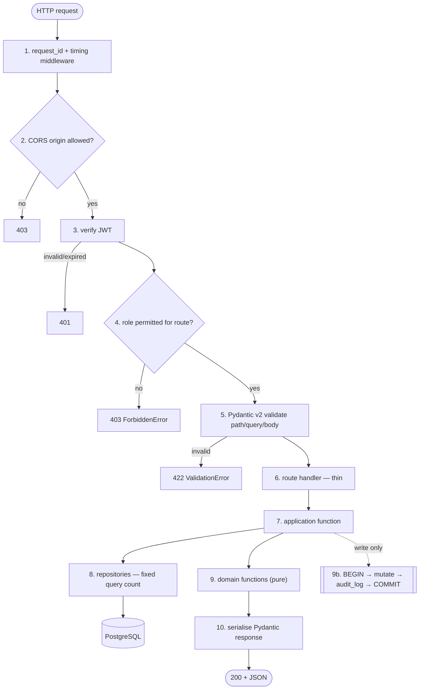
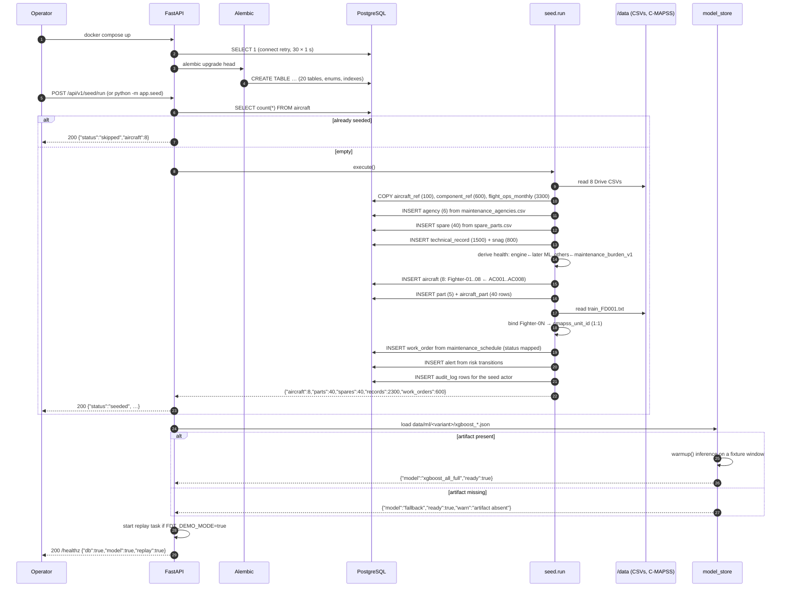
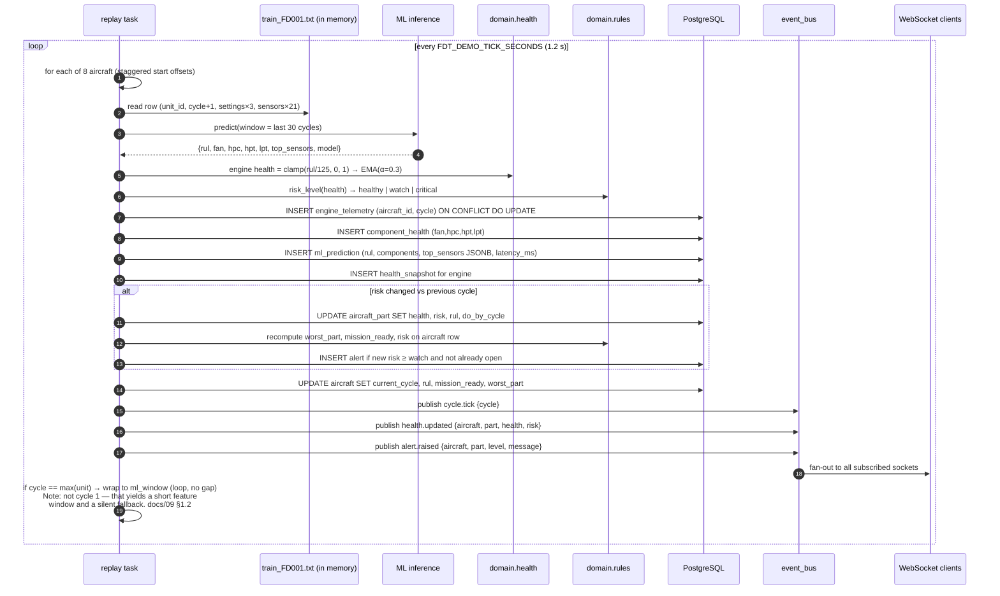
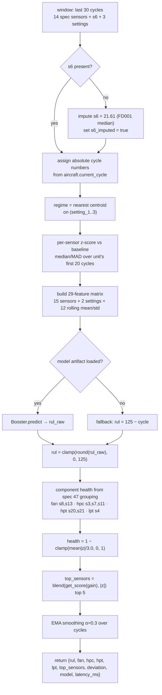
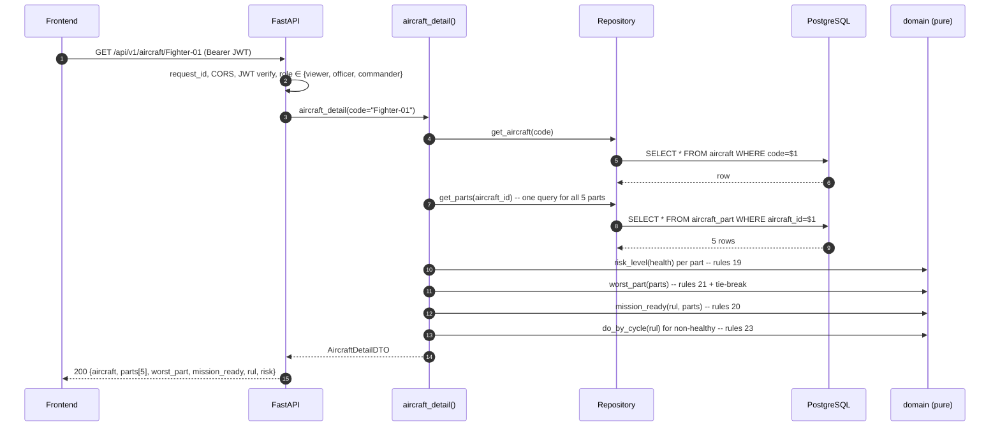
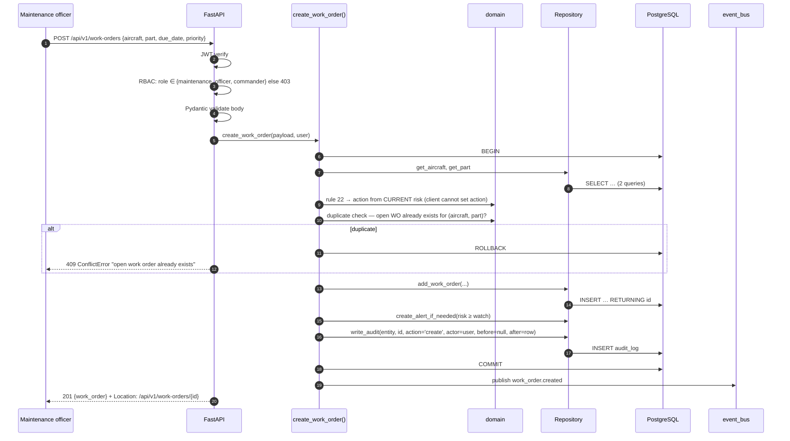
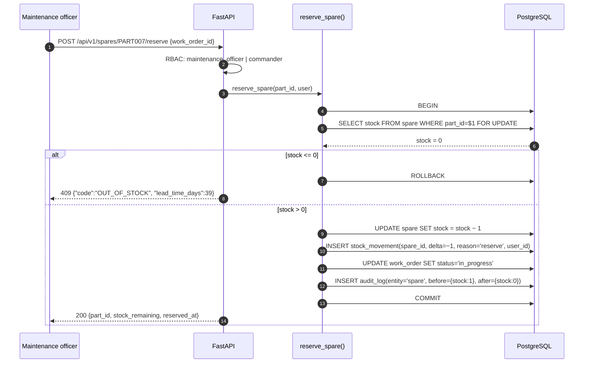
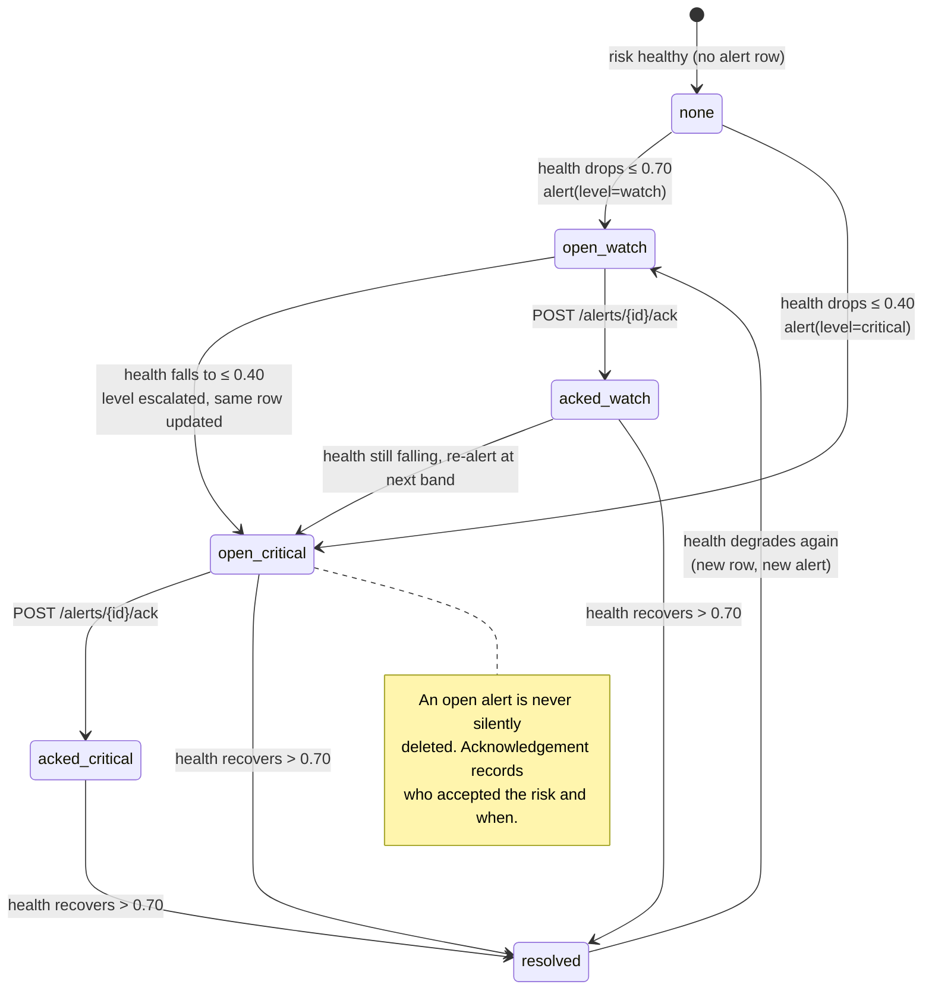
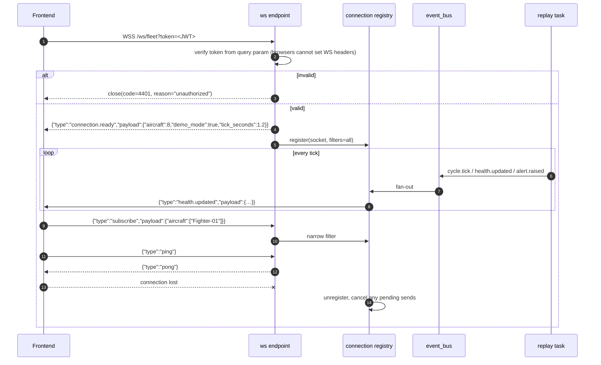
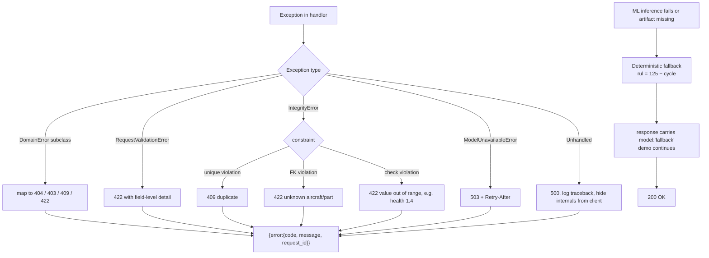

# 03 — System Flow Diagrams

All diagrams are Mermaid. Sequence numbers in prose refer to the steps marked in the
sequence diagrams.

---

## 1. Container architecture

```mermaid
flowchart TB
    subgraph Client["Browser — Fleet Digital Twin UI"]
        UI[React SPA]
        WSC[WebSocket client]
        GLB[Three.js / GLTF viewer]
    end

    subgraph Backend["FastAPI — single process"]
        direction TB
        MW[Request-ID + timing middleware]
        CORS[CORS middleware]
        AUTH[JWT auth + RBAC dependency]
        RT["REST routers /api/v1"]
        WSR["WebSocket /ws/fleet"]
        STAT["StaticFiles /models"]

        subgraph APP["Application layer — use cases"]
            UC1[fleet_summary]
            UC2[aircraft / engine / part detail]
            UC3[actions / schedule]
            UC4[work_orders / spares / agencies / alerts]
            UC5[telemetry_ingest]
        end

        subgraph DOM["Domain layer — PURE, no I/O"]
            R[rules.py<br/>19–26]
            H[health.py<br/>derivation + smoothing]
            A[aggregation.py<br/>series, matrices]
            S[scheduling.py<br/>back-in-service, do-by]
        end

        subgraph MLS["ML subsystem"]
            MS[model_store<br/>load once at lifespan]
            FT[features<br/>30 cycles → 29 features]
            INF[inference<br/>Booster.predict]
            ATT[attribution<br/>z-scores, top sensors]
            FB[fallback<br/>deterministic curve]
        end

        BUS[event_bus<br/>asyncio fan-out]
        REP[replay_engine<br/>1.2 s C-MAPSS loop]
    end

    subgraph Data["Storage"]
        PG[(PostgreSQL 16<br/>operational + reference + time-series)]
        ART[(data/ml/<variant>/<br/>xgboost_*.json<br/>contract + baselines)]
        FILES[/data/raw 8 Drive CSVs<br/>/data/cmapss train_FD001.txt/]
        GLBDIR[(frontend/public/models/*.glb<br/>served by nginx, not the API)]
    end

    UI -->|HTTPS /api/v1| MW
    WSC -->|WSS /ws/fleet| WSR
    GLB -->|GET /models/*.glb| STAT

    MW --> CORS --> AUTH
    AUTH --> RT
    RT --> APP
    APP --> DOM
    APP --> PG
    APP --> MLS
    REP --> MLS
    REP --> PG
    REP --> BUS
    BUS -.->|cycle.tick health.updated alert.raised| WSR
    REP -.-> reads from FILES
    MS -.-> loads from ART
    UC5 -->|POST /telemetry| REP

    STAT --> GLBDIR
    UC1 & UC2 & UC3 & UC4 -.-> read from FILES

    classDef pure fill:#e8f5e9,stroke:#2e7d32,stroke-width:2px
    classDef store fill:#e3f2fd,stroke:#1565c0
    class R,H,A,S pure
    class PG,ART,FILES,GLBDIR store
```

---

## 2. Layered request flow



---

## 3. Startup and seeding



**Seed is idempotent.** Every loader upserts on its natural key (`AC001`, `PART001`,
`MR00001`, `SCH00001`, …), so re-running never duplicates and never destroys operator
changes made at runtime. Runtime-created rows use `source_ref = NULL` and are never touched
by a re-seed.

---

## 4. Replay loop — one demo tick

This is the heart of the demo. One tick = 1.2 s = advance every active aircraft by exactly
one C-MAPSS cycle.



**Ordering guarantee.** All writes for one aircraft-tick commit in a single transaction
before any event is published. A client can therefore never observe a `cycle.tick` for
cycle *n* alongside a `health.updated` still describing cycle *n−1*.

---

## 5. ML inference flow



---

## 6. Read path — `GET /api/v1/aircraft/{id}`



**Five parts, one query.** Not five queries — the N+1 rule from §2 of the architecture doc.

---

## 7. Write path — `POST /api/v1/work-orders`



---

## 8. Write path — `POST /api/v1/spares/{id}/reserve`



`FOR UPDATE` is what makes the stock check safe under the concurrent reservations a live
demo produces. Without it, two officers can both read `stock = 1` and oversell to −1.

---

## 9. Alerts lifecycle



---

## 10. WebSocket lifecycle



---

## 11. Error and degradation flow

