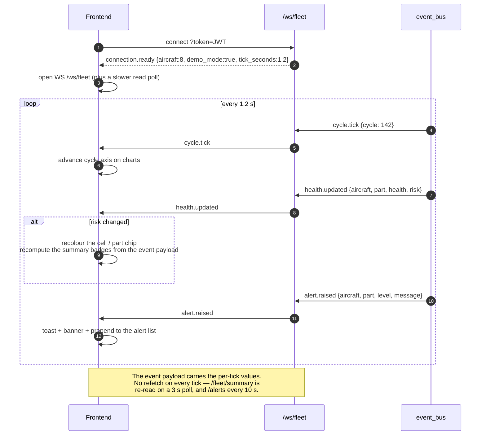
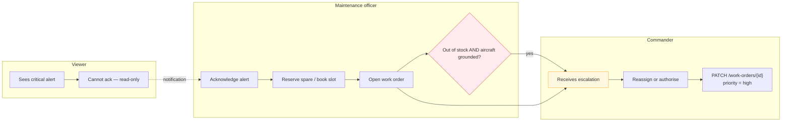
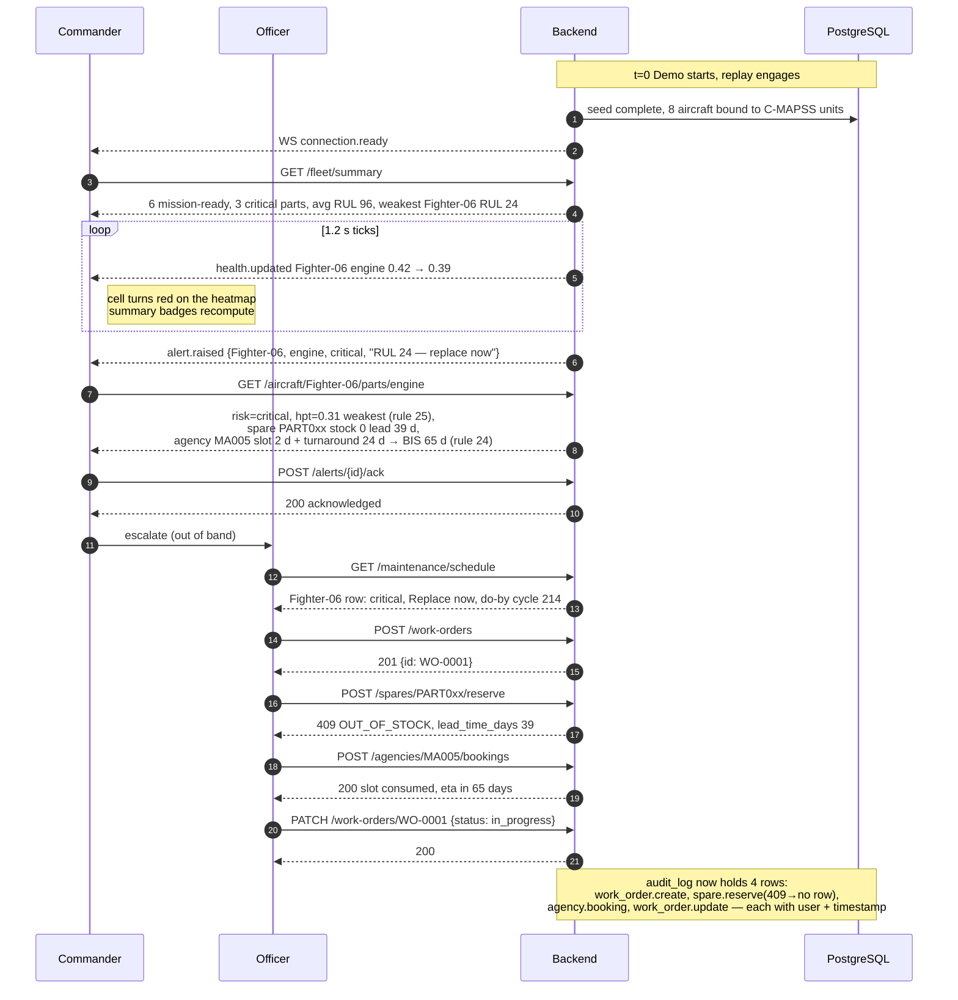

# 04 — User Flow Diagrams

Complete user journeys for the three roles. Each flow names the endpoints called, the rules
applied, and the failure branches the frontend must handle.

## Role capability matrix

| Capability | commander | maintenance_officer | viewer |
|---|:---:|:---:|:---:|
| View dashboard, fleet, aircraft, engine, part detail | ✓ | ✓ | ✓ |
| Receive WebSocket updates | ✓ | ✓ | ✓ |
| View alerts | ✓ | ✓ | ✓ |
| Acknowledge an alert | ✓ | ✓ | — |
| Create work order | ✓ | ✓ | — |
| Update work order status | ✓ | ✓ | — |
| View spares, adjust stock | ✓ | ✓ | — |
| Reserve a spare | ✓ | ✓ | — |
| Book an agency slot | ✓ | ✓ | — |
| Ingest telemetry | ✓ | ✓ | — |
| Internal ML predict | ✓ (service) | ✓ (service) | — |
| Create / edit agency | ✓ | — | — |

Viewers are read-only by a router-level dependency, not by scattered `if role ==` checks —
see [02 §6.4](02-backend-architecture.md).

---

## 1. Authentication — common to all roles

```mermaid
flowchart TD
    A([User opens app]) --> B{Token in localStorage?}
    B -->|yes| C{GET /api/v1/auth/me}
    B -->|no| D[Login form]
    C -->|200 + role| E[Load dashboard]
    C -->|401| D
    D --> F[POST /api/v1/auth/login<br/>{username, password}]
    F --> G{Credentials valid?}
    G -->|no| H[401 — "Invalid username or password"<br/>generic message, no user enumeration]
    G -->|yes| I[Issue JWT HS256<br/>claims: sub, role, exp = now + 720 min]
    I --> J[Store token + role in client state]
    J --> E
    E --> K[Every subsequent request sends<br/>Authorization: Bearer &lt;token&gt;]
    K --> L{Response 401?<br/>token expired}
    L -->|yes| D
    L -->|no| M[Continue]
```

**401 vs 403.** `401` means "log in again" (missing, malformed, expired token). `403` means
"you are logged in but not allowed" — the frontend shows an inline permission message and
**must not** redirect to login.

---

## 2. Commander — mission monitoring

```mermaid
flowchart TD
    A([Commander logs in]) --> B[GET /api/v1/fleet/summary]
    B --> C[Mission Control view]

    C --> D["Cards: mission_ready / total aircraft<br/>critical_parts / avg RUL / lowest-RUL aircraft"]
    C --> E["Chart A: fleet average health, last 60 cycles"]
    C --> F["Chart B: weakest-aircraft health, last 60 cycles"]
    C --> G["Heatmap: 8 aircraft × 5 parts"]

    C --> H[WS /ws/fleet opens automatically]
    H --> I[Live updates every 1.2 s]

    I --> J{Any alert.raised received?}
    J -->|no| I
    J -->|yes| K[Banner + toast:<br/>"Fighter-04 engine CRITICAL — RUL 27"]
    K --> L[GET /api/v1/aircraft/Fighter-04]

    C --> M{Click an aircraft row}
    M --> N[GET /api/v1/aircraft/Fighter-01<br/>health of all five parts]
    N --> O{Which part?}
    O -->|engine| P["GET /aircraft/Fighter-01/engine?window=60<br/>health history, RUL, fan/hpc/hpt/lpt, top sensors"]
    O -->|radar/gear/hyd/fuel| Q["GET /aircraft/Fighter-01/parts/hyd<br/>risk, records, spare, agency, back-in-service"]
    O -->|3D view| R["GET /models/fighter-01.glb<br/>+ /models/engine.glb (static, cached)"]

    P --> S{Satisfied with diagnosis?}
    Q --> S
    S -->|no| T[GET /fleet/actions?limit=5<br/>worst parts ranked, with actions]
    T --> U[GET /maintenance/schedule<br/>one row per aircraft]
    S -->|yes| V[End]

    U --> W{Decide to intervene}
    W -->|delegate| X[Create work order, assign to officer]
    W -->|approve| Y[Acknowledge alert]
    W -->|no| V
```

**Endpoint trace:** `/auth/login` → `/fleet/summary` → `/ws/fleet` → `/aircraft/{id}` →
`/aircraft/{id}/engine` or `/aircraft/{id}/parts/{part}` → `/fleet/actions` →
`/maintenance/schedule` → `POST /work-orders` → `POST /alerts/{id}/ack`

**Rules the commander sees applied:** rule 20 (mission-ready badge), rule 19 (colour bands),
rule 21 (worst part label), rule 26 (RUL ceiling at 125).

---

## 3. Maintenance officer — the primary working flow

```mermaid
flowchart TD
    A([Officer logs in]) --> B[GET /maintenance/schedule]
    B --> C[Maintenance planning table:<br/>aircraft · worst part · risk · action · do-by ·<br/>spare status · agency · back-in-service days]

    C --> D{Risk column}
    D -->|CRITICAL anywhere| E["Filter to critical first<br/>rule 22 → 'Replace now'"]
    D -->|no critical| F[WATCH rows → 'Plan inspection'<br/>rule 22]
    D -->|all healthy| G[Nothing urgent — routine sweep]

    E --> H{Rule 23 — do-by cycle<br/>= RUL − 10}
    H -->|due within 5 cycles| I[URGENT — escalate to commander]
    H -->|due later| J[Plan into this week's work]

    E & F --> K[GET /fleet/actions?limit=5<br/>worst parts with spare + agency context]

    K --> L{Spare in stock?}
    L -->|stock > 0| M["Back-in-service = slot + turnaround<br/>rule 24, no lead time"]
    L -->|stock = 0| N["Back-in-service = slot + turnaround + lead time<br/>rule 24 — expect a long wait"]

    M & N --> O[Select the aircraft row]
    O --> P[GET /aircraft/Fighter-04/parts/engine]
    P --> Q[Review: health · risk · fan/hpc/hpt/lpt ·<br/>last 2 technical records · spare · agency]
    Q --> R{Rule 25 — which module?<br/>weakest of fan/hpc/hpt/lpt}
    R --> S[Confirm the spare matches that module]
    S --> T[POST /work-orders<br/>{aircraft, part, due_date, priority}]
    T --> U{201 Created?}
    U -->|no — 409| V["Open work order already exists<br/>→ PATCH existing instead"]
    U -->|yes| W[POST /spares/PART007/reserve]
    W --> X{Stock available?}
    X -->|no — 409| Y["Blocked. lead_time_days shown.<br/>→ POST /agencies/MA005/bookings to book a slot anyway"]
    X -->|yes| Z[POST /agencies/MA005/bookings<br/>consume a slot]
    Z --> AA[PATCH /work-orders/{id}<br/>status = in_progress]
    AA --> AB[Monitor until parts arrive,<br/>then status = done]
    AB --> AC[GET /alerts → POST /alerts/{id}/ack<br/>acknowledging the risk on record]
```

**Endpoint trace:** `/auth/login` → `/maintenance/schedule` → `/fleet/actions` →
`/aircraft/{id}/parts/{part}` → `POST /work-orders` → `POST /spares/{id}/reserve` →
`POST /agencies/{id}/bookings` → `PATCH /work-orders/{id}` → `GET /alerts` →
`POST /alerts/{id}/ack`

### Decision table the officer works from

| Risk (rule 19) | Action (rule 22) | Do-by (rule 23) | Officer moves to |
|---|---|---|---|
| `health > 0.70` healthy | Routine check | — | Next scheduled sweep |
| `0.40 < health ≤ 0.70` watch | Plan inspection | `RUL − 10` cycles | Book inspection slot |
| `health ≤ 0.40` critical | Replace now | `RUL − 10` cycles | Reserve spare + book depot |

### Stock-out branch in detail

```mermaid
flowchart TD
    A[Rule 25 → weakest module, e.g. HPT] --> B[Lookup spare where component_name = High Pressure Turbine]
    B --> C{stock > 0?}
    C -->|yes| D[Reserve now.<br/>Back-in-service = slot + turnaround]
    C -->|no| E["Back-in-service = slot + turnaround + lead_time_days<br/>rule 24 — lead time is added ONLY when stock is 0"]
    E --> F{Is the aircraft still mission-ready?<br/>rule 20}
    F -->|yes| G["Yes — RUL > 30 and all parts > 0.4.<br/>Keep flying, monitor."]
    F -->|no| H["No — ground the aircraft.<br/>Raise a critical alert to the commander."]
    H --> I[POST /work-orders with priority=high]
    I --> J[POST /agencies/{id}/bookings to queue the slot]
```

---

## 4. Viewer — read-only

```mermaid
flowchart TD
    A([Viewer logs in]) --> B[GET /fleet/summary]
    B --> C[Read-only dashboard]
    C --> D[Live WebSocket updates]
    C --> E[GET /aircraft/{id} → /parts/{part} → /engine]
    C --> F[GET /maintenance/schedule — view only]
    C --> G[GET /spares — view only]
    C --> H[GET /alerts — view only]

    H --> I{Tries to acknowledge?}
    I --> J[POST /alerts/{id}/ack → 403 ForbiddenError]
    J --> K[Frontend hides the button AND handles 403 gracefully:<br/>"Requires maintenance_officer or commander"]

    C --> L{Tries any mutation?}
    L --> M[All PATCH/POST → 403]
    M --> N[Viewer role is read-only by design.<br/>No data is modified.]
```

**Frontend obligation:** role-gate the UI *and* handle 403 on every mutation. Hiding a
button is UX, not security — the server is the enforcement point, and the client must not
assume a 403 is impossible.

---

## 5. WebSocket live-update flow (all roles)



**Performance rule for the frontend:** do **not** refetch `/fleet/summary` on every tick.
The WebSocket payloads carry the per-tick values; the fleet-wide reads keep their own slower
poll (3 s, and 10 s for alerts) which also reconciles anything missed during a reconnect.
Where both deliver the same field, the newer socket frame wins — a poll issued before a tick
must not overwrite the tick that arrived while it was in flight.

---

## 6. Telemetry ingestion flow

```mermaid
flowchart TD
    A([Sensor gateway OR demo replay]) --> B{Source}
    B -->|demo replay| C[replay task reads train_FD001.txt]
    B -->|external| D["POST /api/v1/telemetry<br/>{aircraft, rows:[{cycle, settings…, sensors…}]}"]

    D --> E{Validate batch}
    E -->|unknown aircraft| E1[422 ValidationError]
    E -->|rows for mixed aircraft| E2["422 — 'one aircraft per batch' per spec 40"]
    E -->|sensor out of physical range| E3[422 with the offending row index]
    E -->|valid| F[RBAC: not viewer]

    F --> G[BEGIN]
    G --> H["INSERT engine_telemetry … ON CONFLICT (aircraft_id, cycle) DO UPDATE"]
    H --> I[Run ML inference on the trailing 30-cycle window]
    I --> J{Prediction succeeded?}
    J -->|no| J1[Deterministic fallback<br/>rul = 125 − cycle]
    J -->|yes| K[Store rul + component health + top_sensors]
    J1 --> K
    K --> L[INSERT ml_prediction (with latency_ms)]
    L --> M[INSERT health_snapshot]
    M --> N[Recompute risk, worst part, mission-ready]
    N --> O{Risk changed?}
    O -->|yes| P[Create / escalate alert]
    O -->|no| Q[No alert]
    P --> R[audit_log + COMMIT]
    Q --> R
    R --> S[Publish health.updated + alert.raised]
    S --> T[202 Accepted {rows_written, rul, risk}]
```

---

## 7. Cross-role escalation



---

## 8. Error journeys the frontend must handle

| Situation | Backend response | Frontend behaviour |
|---|---|---|
| Token expired | `401` on any call | Clear session, redirect to login |
| Viewer attempts a mutation | `403 ForbiddenError` | Inline "insufficient permission"; do **not** log out |
| Reserve with zero stock | `409 OUT_OF_STOCK` + `lead_time_days` | Show the wait estimate from rule 24 |
| Duplicate work order | `409` | Offer "open the existing one" instead |
| Unknown aircraft code | `404` | Toast + refresh the list |
| Aircraft in the path, engine in the body | `422` | Highlight the mismatched field |
| WebSocket drops | close frame, then reconnect | Exponential backoff 1→2→4→8 s, resync via `/fleet/summary` |
| ML artifact missing | `200` with `model: "fallback"` | Show a subtle "estimated" chip — **do not** treat as an error |
| `health` outside 0–1 | never happens (DB CHECK) | — |

---

## 9. End-to-end happy path (the demo script)



This single script exercises every business rule, every write path, the audit trail, and the
WebSocket — it is the acceptance walkthrough for the demo.