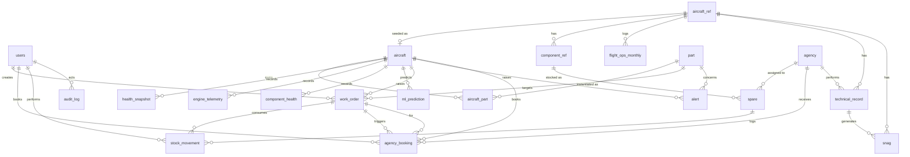

# 05 — Database Design

PostgreSQL 16. 20 tables in 4 groups: **reference** (loaded verbatim from Drive CSVs),
**fleet** (the 8-aircraft operational core), **time-series / ML**, and **maintenance /
audit**. Full DDL, indexes, relationships, and the derived-column strategy.

---

## 1. Design principles

1. **Reference data is never mutated at runtime.** `aircraft_ref`, `component_ref`,
   `flight_ops_monthly`, `technical_record`, `snag` are write-once at seed. Runtime activity
   goes to operational tables.
2. **Derived state is denormalised onto `aircraft` and `aircraft_part`.** `mission_ready`,
   `risk_level`, `worst_part`, `rul`, `do_by_cycle` are computed by the domain layer and
   stored. A dashboard must not require 8 × 5 = 40 rule evaluations per request inside a
   200 ms budget.
3. **Time-series tables are append-only, keyed `(aircraft_id, cycle)`.** The replay loop
   upserts on that key, so re-running a tick is idempotent.
4. **Every FK is indexed.** Postgres does not index the referencing side automatically.
5. **Enums for closed vocabularies, `CHECK` for numeric ranges, `JSONB` for open structures.**
   `risk_level` and `alert.level` are enums (frontend switches on them); `top_sensors` is
   JSONB (its shape is model-dependent and will change).
6. **All timestamps are `TIMESTAMPTZ`.** A demo may be run across a DST boundary; naive
   timestamps would silently shift the audit trail.
7. **Money and quantities are integers.** `cost_inr BIGINT`, `unit_cost_inr INTEGER`. The
   source data is integral; no float money.

---

## 2. Entity-relationship overview



---

## 3. Reference tables (verbatim from Drive CSVs)

### 3.1 `aircraft_ref` ← `aircraft.csv` (100 rows)

```sql
CREATE TABLE aircraft_ref (
    id                  SERIAL PRIMARY KEY,
    aircraft_id         VARCHAR(8)  NOT NULL UNIQUE,   -- 'AC001'
    tail_number         VARCHAR(16) NOT NULL,
    aircraft_model      VARCHAR(16) NOT NULL,          -- Type-A | Type-B | Type-C
    engine_id           VARCHAR(16) NOT NULL,
    engine_model        VARCHAR(16) NOT NULL,          -- Engine-X | Engine-Y | Engine-Z
    manufacture_date    DATE,
    induction_date      DATE,
    home_base           VARCHAR(16),                   -- Base-A … Base-E
    total_flight_hours  INTEGER,
    total_cycles        INTEGER,
    current_status      VARCHAR(24)                    -- Serviceable | Under Maintenance
                                                        -- | Awaiting Spares | Grounded
);
CREATE INDEX ix_aircraft_ref_model ON aircraft_ref (aircraft_model);
```

### 3.2 `component_ref` ← `components.csv` (600 rows)

```sql
CREATE TABLE component_ref (
    id                  SERIAL PRIMARY KEY,
    component_id        VARCHAR(12) NOT NULL UNIQUE,   -- 'CMP0001'
    aircraft_ref_id     INTEGER NOT NULL REFERENCES aircraft_ref(id) ON DELETE CASCADE,
    engine_id           VARCHAR(16) NOT NULL,
    component_name      VARCHAR(48) NOT NULL,
    -- Fan | Low Pressure Compressor | High Pressure Compressor
    -- | High Pressure Turbine | Low Pressure Turbine | Combustor
    component_system    VARCHAR(24) NOT NULL,          -- Fan | Compressor | Turbine | Combustion
    installation_date   DATE,
    operating_hours     INTEGER,
    operating_cycles    INTEGER,
    life_limit_hours    INTEGER,
    life_limit_cycles   INTEGER,
    health_status       VARCHAR(16),                   -- Good | Watch | Degraded
    times_replaced      SMALLINT DEFAULT 0,
    CONSTRAINT ck_component_health_status
        CHECK (health_status IN ('Good', 'Watch', 'Degraded'))
);
CREATE INDEX ix_component_ref_aircraft ON component_ref (aircraft_ref_id);
CREATE INDEX ix_component_ref_name     ON component_ref (component_name);

-- Life-fraction health, used to cross-check the ML-derived engine health
CREATE VIEW v_component_life_fraction AS
SELECT id, component_name,
       operating_cycles::NUMERIC / NULLIF(life_limit_cycles, 0) AS life_fraction,
       1 - (operating_cycles::NUMERIC / NULLIF(life_limit_cycles, 0)) AS implied_health
FROM component_ref;
```

### 3.3 `flight_ops_monthly` ← `flight_operations.csv` (3300 rows)

```sql
CREATE TABLE flight_ops_monthly (
    id                      SERIAL PRIMARY KEY,
    aircraft_ref_id         INTEGER NOT NULL REFERENCES aircraft_ref(id) ON DELETE CASCADE,
    month                   CHAR(7) NOT NULL,          -- 'YYYY-MM'
    flight_hours            NUMERIC(8,2),
    sorties                 SMALLINT,
    flight_cycles           SMALLINT,
    avg_sortie_duration_hours NUMERIC(5,2),
    high_stress_sorties     SMALLINT,                  -- degradation driver
    days_available          SMALLINT,
    days_unavailable        SMALLINT,
    UNIQUE (aircraft_ref_id, month),
    CONSTRAINT ck_month_format CHECK (month ~ '^\d{4}-\d{2}$')
);
CREATE INDEX ix_flight_ops_aircraft ON flight_ops_monthly (aircraft_ref_id, month DESC);

-- Availability KPI surfaced on /fleet/summary
CREATE VIEW v_aircraft_availability AS
SELECT a.code,
       ROUND(AVG(f.days_available::NUMERIC
                 / NULLIF(f.days_available + f.days_unavailable, 0)), 4) AS availability
FROM aircraft a
JOIN aircraft_ref r          ON r.id = a.aircraft_ref_id
JOIN flight_ops_monthly f    ON f.aircraft_ref_id = r.id
GROUP BY a.code;
```

### 3.4 `technical_record` ← `maintenance_records.csv` (1500 rows)

```sql
CREATE TABLE technical_record (
    id                  SERIAL PRIMARY KEY,
    record_id           VARCHAR(12) NOT NULL UNIQUE,   -- 'MR00001'
    aircraft_ref_id     INTEGER NOT NULL REFERENCES aircraft_ref(id),
    component_ref_id    INTEGER REFERENCES component_ref(id),
    agency_ref_id       VARCHAR(8),                    -- soft ref, see 3.5
    part_ref_id         VARCHAR(8),
    event_date          DATE NOT NULL,
    maintenance_type    VARCHAR(32),                   -- Corrective | Preventive Replacement
                                                        -- | Scheduled Inspection | Unscheduled Removal
    fault_type          VARCHAR(40),                   -- 10 distinct values + NULL
    action              TEXT,
    downtime_hours      NUMERIC(7,1),
    cost_inr            BIGINT,
    flight_hours_at_event NUMERIC(9,1),
    cycles_at_event     INTEGER,                       -- NOT the C-MAPSS cycle
    outcome             VARCHAR(16)                    -- Resolved | Deferred | Recurring
);
CREATE INDEX ix_techrec_aircraft ON technical_record (aircraft_ref_id, event_date DESC);
CREATE INDEX ix_techrec_fault    ON technical_record (fault_type)
       WHERE fault_type IS NOT NULL;   -- partial: drives non-engine health
```

### 3.5 `snag` ← `snag_logs.csv` (800 rows)

```sql
CREATE TABLE snag (
    id                      SERIAL PRIMARY KEY,
    snag_id                 VARCHAR(12) NOT NULL UNIQUE, -- 'SNAG0001'
    technical_record_id     INTEGER REFERENCES technical_record(id) ON DELETE SET NULL,
    aircraft_ref_id         INTEGER NOT NULL REFERENCES aircraft_ref(id),
    date_reported           DATE NOT NULL,
    reported_by_role        VARCHAR(16),                  -- Pilot | Technician | Engineer
    snag_text               TEXT NOT NULL,
    severity                VARCHAR(8) NOT NULL,          -- Critical | Major | Minor
    resolution_text         TEXT,
    CONSTRAINT ck_snag_severity CHECK (severity IN ('Critical', 'Major', 'Minor'))
);
CREATE INDEX ix_snag_aircraft ON snag (aircraft_ref_id, date_reported DESC);
CREATE INDEX ix_snag_severity ON snag (severity);
```

> **Note on `agency_ref_id` / `part_ref_id` in `technical_record`.** These hold the *source*
> identifiers (`MA006`, `PART007`) but deliberately do not FK to `agency`/`spare`, because
> the source data references IDs that do not always exist in the 6-row agency list or the
> 40-row spare list. A hard FK would fail the seed on ~40 orphaned references. They are
> indexed as plain columns; operational code always uses the real FKs from
> `work_order`/`agency_booking` instead.

---

## 4. Auth and audit

```sql
CREATE TYPE user_role AS ENUM ('commander', 'maintenance_officer', 'viewer');

CREATE TABLE users (
    id              SERIAL PRIMARY KEY,
    username        VARCHAR(48) NOT NULL UNIQUE,
    password_hash   VARCHAR(255) NOT NULL,          -- bcrypt, cost 12
    full_name       VARCHAR(96) NOT NULL,
    role            user_role NOT NULL,
    created_at      TIMESTAMPTZ NOT NULL DEFAULT now(),
    last_login_at   TIMESTAMPTZ
);

CREATE TABLE audit_log (
    id          BIGSERIAL PRIMARY KEY,
    entity      VARCHAR(32) NOT NULL,      -- work_order | spare | agency | booking | alert
    entity_id   VARCHAR(32) NOT NULL,
    action      VARCHAR(24) NOT NULL,      -- create | update | reserve | restock
                                            -- | adjust | book | cancel | ack
    actor_id    INTEGER REFERENCES users(id) ON DELETE SET NULL,
    actor_name  VARCHAR(48) NOT NULL,      -- denormalised: survives user deletion
    at          TIMESTAMPTZ NOT NULL DEFAULT now(),
    before      JSONB,
    after       JSONB,
    request_id  VARCHAR(32),
    CONSTRAINT ck_audit_has_diff CHECK (before IS NOT NULL OR after IS NOT NULL)
);
CREATE INDEX ix_audit_entity ON audit_log (entity, entity_id, at DESC);
CREATE INDEX ix_audit_actor  ON audit_log (actor_id, at DESC);
CREATE INDEX ix_audit_at     ON audit_log (at DESC);
```

`actor_name` is denormalised on purpose — spec item 51 requires logging *the user*, and an
audit trail that goes blank when a user row is deleted is not an audit trail.

---

## 5. Fleet tables

```sql
CREATE TABLE part (
    id              SERIAL PRIMARY KEY,
    code            VARCHAR(16) NOT NULL UNIQUE,   -- engine | radar | gear | hyd | fuel
    label           VARCHAR(32) NOT NULL,          -- Engine | Radar | Landing Gear | Hydraulics | Fuel
    sort_order      SMALLINT NOT NULL,             -- tie-break order, see rules 21
    is_simulated    BOOLEAN NOT NULL,             -- true for all but 'engine'
    method          VARCHAR(40) NOT NULL,          -- rul_xgb_fd001 | maintenance_burden_v1
    agency_id       INTEGER REFERENCES agency(id),  -- part → agency assignment, rule 15
    CONSTRAINT ck_part_code CHECK (code IN ('engine','radar','gear','hyd','fuel'))
);
-- exactly 5 rows, seeded by migration; sort_order: engine=1 radar=2 gear=3 hyd=4 fuel=5

CREATE TABLE aircraft (
    id                  SERIAL PRIMARY KEY,
    code                VARCHAR(16) NOT NULL UNIQUE,  -- 'Fighter-01'
    name                VARCHAR(48) NOT NULL,
    aircraft_ref_id     INTEGER NOT NULL REFERENCES aircraft_ref(id),
    cmapss_unit_id      SMALLINT NOT NULL,            -- C-MAPSS unit_id, 1:1
    tail_number         VARCHAR(16),
    aircraft_model      VARCHAR(16),
    home_base           VARCHAR(16),

    current_cycle       INTEGER NOT NULL DEFAULT 1,
    rul                 INTEGER NOT NULL DEFAULT 125,  -- capped, rule 26
    mission_ready       BOOLEAN NOT NULL DEFAULT TRUE,-- denormalised, rule 20
    worst_part          VARCHAR(16),                  -- denormalised, rule 21
    risk_level          risk_level NOT NULL DEFAULT 'healthy',
    demo_offset         INTEGER NOT NULL DEFAULT 0,  -- stagger start, see 09 §4
    is_active           BOOLEAN NOT NULL DEFAULT TRUE,
    created_at          TIMESTAMPTZ NOT NULL DEFAULT now(),
    updated_at          TIMESTAMPTZ NOT NULL DEFAULT now(),

    CONSTRAINT ck_aircraft_cycle CHECK (current_cycle >= 1),
    CONSTRAINT ck_aircraft_rul    CHECK (rul BETWEEN 0 AND 125),
    CONSTRAINT ck_aircraft_worst  CHECK (worst_part IN ('engine','radar','gear','hyd','fuel')),
    CONSTRAINT uq_aircraft_unit   UNIQUE (cmapss_unit_id)
);
CREATE INDEX ix_aircraft_ready ON aircraft (mission_ready);
CREATE INDEX ix_aircraft_risk   ON aircraft (risk_level);
```

### 5.1 `aircraft_part` — the heart of the state model (40 rows)

```sql
CREATE TYPE risk_level AS ENUM ('healthy', 'watch', 'critical');

CREATE TABLE aircraft_part (
    id                  SERIAL PRIMARY KEY,
    aircraft_id         INTEGER NOT NULL REFERENCES aircraft(id) ON DELETE CASCADE,
    part_id             INTEGER NOT NULL REFERENCES part(id),
    health              NUMERIC(4,3) NOT NULL,
    risk_level          risk_level NOT NULL,
    rul                 INTEGER,                       -- engine only; NULL for others
    do_by_cycle         INTEGER,                       -- rule 23; NULL when healthy
    worst_component     VARCHAR(24),                   -- fan|hpc|hpt|lpt, rule 25
    spare_id            INTEGER REFERENCES spare(id), -- resolved spare
    agency_id           INTEGER REFERENCES agency(id),
    back_in_service_days INTEGER,                      -- rule 24
    is_simulated        BOOLEAN NOT NULL,
    updated_at          TIMESTAMPTZ NOT NULL DEFAULT now(),

    UNIQUE (aircraft_id, part_id),
    CONSTRAINT ck_ap_health  CHECK (health BETWEEN 0 AND 1),
    CONSTRAINT ck_ap_risk    CHECK (risk_level IN ('healthy','watch','critical')),
    CONSTRAINT ck_ap_rul     CHECK (rul IS NULL OR rul BETWEEN 0 AND 125),
    CONSTRAINT ck_ap_doby    CHECK (do_by_cycle IS NULL OR do_by_cycle > 0),
    CONSTRAINT ck_ap_bis     CHECK (back_in_service_days IS NULL OR back_in_service_days >= 0),
    CONSTRAINT ck_ap_wc      CHECK (worst_component IS NULL
                                    OR worst_component IN ('fan','hpc','hpt','lpt'))
);
CREATE INDEX ix_ap_aircraft   ON aircraft_part (aircraft_id);
CREATE INDEX ix_ap_risk       ON aircraft_part (risk_level);
CREATE INDEX ix_ap_health_idx ON aircraft_part (health);   -- "worst parts" ordering
CREATE INDEX ix_ap_critical   ON aircraft_part (aircraft_id)
       WHERE risk_level = 'critical';                       -- partial, hot path
```

`health` carries a `CHECK (0 <= health <= 1)` at the database level, so an out-of-range
health from any code path is rejected by Postgres rather than reaching the frontend.

---

## 6. Time-series and ML tables

```sql
CREATE TABLE health_snapshot (
    id              BIGSERIAL PRIMARY KEY,
    aircraft_id     INTEGER NOT NULL REFERENCES aircraft(id) ON DELETE CASCADE,
    part_id         INTEGER NOT NULL REFERENCES part(id),
    cycle           INTEGER NOT NULL,
    health          NUMERIC(4,3) NOT NULL,
    risk_level      risk_level NOT NULL,
    recorded_at     TIMESTAMPTZ NOT NULL DEFAULT now(),
    UNIQUE (aircraft_id, part_id, cycle),
    CONSTRAINT ck_hs_health CHECK (health BETWEEN 0 AND 1)
);
-- Serves "last N cycles" for all 5 parts in one index range scan
CREATE INDEX ix_hs_window ON health_snapshot (aircraft_id, part_id, cycle DESC);
CREATE INDEX ix_hs_recent ON health_snapshot (aircraft_id, cycle DESC);

CREATE TABLE engine_telemetry (
    id              BIGSERIAL PRIMARY KEY,
    aircraft_id     INTEGER NOT NULL REFERENCES aircraft(id) ON DELETE CASCADE,
    cycle           INTEGER NOT NULL,
    cmapss_unit_id  SMALLINT NOT NULL,
    setting_1       NUMERIC(10,6) NOT NULL,
    setting_2       NUMERIC(10,6) NOT NULL,
    setting_3       NUMERIC(10,6) NOT NULL,
    s2   NUMERIC(12,4) NOT NULL,  s3   NUMERIC(12,4) NOT NULL,
    s4   NUMERIC(12,4) NOT NULL,  s6   NUMERIC(12,4) NOT NULL,
    s7   NUMERIC(12,4) NOT NULL,  s8   NUMERIC(12,4) NOT NULL,
    s9   NUMERIC(12,4) NOT NULL,  s11  NUMERIC(12,4) NOT NULL,
    s12  NUMERIC(12,4) NOT NULL,  s13  NUMERIC(12,4) NOT NULL,
    s14  NUMERIC(12,4) NOT NULL,  s15  NUMERIC(12,4) NOT NULL,
    s17  NUMERIC(12,4) NOT NULL,  s20  NUMERIC(12,4) NOT NULL,
    s21  NUMERIC(12,4) NOT NULL,
    regime           SMALLINT NOT NULL DEFAULT 0,
    source           VARCHAR(16) NOT NULL DEFAULT 'cmapss',
    recorded_at      TIMESTAMPTZ NOT NULL DEFAULT now(),
    UNIQUE (aircraft_id, cycle),
    CONSTRAINT ck_tel_source CHECK (source IN ('cmapss','api'))
);
CREATE INDEX ix_tel_window ON engine_telemetry (aircraft_id, cycle DESC);

CREATE TABLE component_health (
    id              BIGSERIAL PRIMARY KEY,
    aircraft_id     INTEGER NOT NULL REFERENCES aircraft(id) ON DELETE CASCADE,
    cycle           INTEGER NOT NULL,
    fan             NUMERIC(4,3) NOT NULL,
    hpc             NUMERIC(4,3) NOT NULL,
    hpt             NUMERIC(4,3) NOT NULL,
    lpt             NUMERIC(4,3) NOT NULL,
    combustor       NUMERIC(4,3),         -- extended head, C-MAPSS has no combustor sensor
    lpc             NUMERIC(4,3),         -- extended head
    recorded_at     TIMESTAMPTZ NOT NULL DEFAULT now(),
    UNIQUE (aircraft_id, cycle),
    CONSTRAINT ck_ch_range CHECK (fan BETWEEN 0 AND 1 AND hpc BETWEEN 0 AND 1
                              AND hpt BETWEEN 0 AND 1 AND lpt BETWEEN 0 AND 1)
);

CREATE TABLE ml_prediction (
    id              BIGSERIAL PRIMARY KEY,
    aircraft_id     INTEGER NOT NULL REFERENCES aircraft(id) ON DELETE CASCADE,
    cycle           INTEGER NOT NULL,
    rul             INTEGER NOT NULL,
    fan             NUMERIC(4,3), hpc   NUMERIC(4,3),
    hpt             NUMERIC(4,3), lpt   NUMERIC(4,3),
    top_sensors     JSONB NOT NULL,      -- [{"sensor":"s11","contribution":0.19,"z":2.4}, …]
    deviation       JSONB NOT NULL,      -- {"s2":0.11,"s3":0.42, …} for all 15 sensors
    model_version   VARCHAR(48) NOT NULL,-- 'rul_xgb_fd001' | 'fallback'
    latency_ms      NUMERIC(8,2) NOT NULL,
    created_at      TIMESTAMPTZ NOT NULL DEFAULT now(),
    UNIQUE (aircraft_id, cycle),
    CONSTRAINT ck_mlp_rul CHECK (rul BETWEEN 0 AND 125)
);
CREATE INDEX ix_mlp_latest ON ml_prediction (aircraft_id, cycle DESC);
```

**Latest-row-per-aircraft without a window function.** The dashboard needs the newest
prediction for 8 aircraft on every request. A `DISTINCT ON` subquery is one index scan per
aircraft; a lateral join over the partial index below is faster still:

```sql
CREATE INDEX ix_mlp_live ON ml_prediction (aircraft_id, cycle DESC)
    WHERE model_version <> 'fallback';

CREATE VIEW v_latest_prediction AS
SELECT DISTINCT ON (aircraft_id)
       aircraft_id, cycle, rul, fan, hpc, hpt, lpt, top_sensors, model_version, latency_ms
FROM ml_prediction
ORDER BY aircraft_id, cycle DESC;
```

---

## 7. Maintenance tables

```sql
CREATE TABLE agency (
    id                  SERIAL PRIMARY KEY,
    agency_ref_id       VARCHAR(8) NOT NULL UNIQUE,   -- 'MA001'
    name                VARCHAR(96) NOT NULL,
    type                VARCHAR(32),                  -- Base Repair Depot | Field Maintenance
                                                        -- Unit | OEM Service Centre | Third-Party MRO
    location            VARCHAR(32),                  -- Base-A…Base-E | Central Depot
    specialisation      VARCHAR(24) NOT NULL,         -- general | engine | avionics | hydraulics
    turnaround_days     SMALLINT NOT NULL,
    monthly_capacity_slots SMALLINT NOT NULL,
    cost_multiplier     NUMERIC(3,2) NOT NULL DEFAULT 1.00,
    free_slot_days      SMALLINT NOT NULL,            -- derived, see below
    CONSTRAINT ck_agency_turn CHECK (turnaround_days > 0),
    CONSTRAINT ck_agency_cap   CHECK (monthly_capacity_slots > 0),
    CONSTRAINT ck_agency_free  CHECK (free_slot_days >= 0)
);
CREATE INDEX ix_agency_spec ON agency (specialisation);

CREATE TABLE spare (
    id                  SERIAL PRIMARY KEY,
    part_ref_id         VARCHAR(8) NOT NULL UNIQUE,   -- 'PART007'
    item_name           VARCHAR(96) NOT NULL,
    component_ref_id    INTEGER REFERENCES component_ref(id),
    component_name      VARCHAR(48),                  -- Fan | High Pressure Turbine | …
    aircraft_model      VARCHAR(16),                  -- All | Type-A | Type-B | Type-C
    stock               INTEGER NOT NULL DEFAULT 0,
    minimum_stock       INTEGER NOT NULL DEFAULT 0,
    reorder_quantity    INTEGER NOT NULL DEFAULT 0,
    supplier            VARCHAR(64),
    lead_time_days      SMALLINT NOT NULL,
    unit_cost_inr       INTEGER,
    storage_location    VARCHAR(32),
    last_restock_date   DATE,
    criticality         VARCHAR(8),                   -- High | Medium | Low
    CONSTRAINT ck_spare_stock CHECK (stock >= 0),
    CONSTRAINT ck_spare_lead  CHECK (lead_time_days >= 0)
);
CREATE INDEX ix_spare_component ON spare (component_name);
CREATE INDEX ix_spare_critical  ON spare (criticality) WHERE stock <= minimum_stock;

-- Rule 25: weakest of fan/hpc/hpt/lpt → the spare for that component
CREATE VIEW v_spare_for_component AS
SELECT component_name,
       MIN(part_ref_id)          AS part_ref_id,
       (ARRAY_AGG(item_name     ORDER BY criticality DESC, stock ASC))[1] AS item_name,
       MAX(lead_time_days)       AS max_lead_time_days
FROM spare
WHERE component_name IN ('Fan','High Pressure Compressor',
                         'High Pressure Turbine','Low Pressure Turbine')
GROUP BY component_name;
```

### 7.1 `free_slot_days` — derived, since the source has no such column

```sql
-- Implemented in Python: app/domain/scheduling.py::agency_free_slot_days
--   free = 0                                     if the 30-day horizon is full
--   free = max(1, ceil((1 - booked/30) * 30 / capacity_slots))  otherwise
-- Monotonically non-increasing as bookings accumulate, and it reproduces the
-- seeded idle values in the table below. The SQL form is the same arithmetic:

CREATE OR REPLACE FUNCTION agency_free_slot_days(p_agency INTEGER)
RETURNS INTEGER LANGUAGE sql STABLE AS $$
    SELECT CASE
        WHEN COALESCE(SUM(b.turnaround_days), 0) >= 30 THEN 0
        ELSE GREATEST(1, CEIL(
            (30.0 - COALESCE(SUM(b.turnaround_days), 0))
            / a.monthly_capacity_slots
        )::INTEGER)
    END
    FROM agency a
    LEFT JOIN agency_booking b
           ON b.agency_id = a.id
          AND b.completed_at IS NULL
    WHERE a.id = p_agency
    GROUP BY a.id, a.monthly_capacity_slots;
$$;
```

Worked from the real data — an idle agency shows `CEIL(30 / capacity_slots_per_month)`:

| Agency | Specialisation | Capacity | Turnaround | `free_slot_days` |
|---|---|---:|---:|---:|
| MA001 AeroCore Base Repair | general | 40 | 13 | 1 |
| MA002 SwiftWing Field Services | general | 19 | 3 | 2 |
| MA003 Vector Engine Works | engine | 11 | 24 | 3 |
| MA004 Skyline Avionics MRO | avionics | 25 | 9 | 2 |
| MA005 HydraFlight Services | hydraulics | 23 | 11 | 2 |
| MA006 RapidAir Field Support | general | 16 | 3 | 2 |

`free_slot_days` is cached on the row and recomputed inside the same transaction as any
booking, so rule 24 always reads a consistent value.

### 7.2 Work orders

```sql
CREATE TYPE work_order_status AS ENUM ('open', 'in_progress', 'done');
CREATE TYPE priority_level    AS ENUM ('low', 'medium', 'high');

CREATE TABLE work_order (
    id              SERIAL PRIMARY KEY,
    reference       VARCHAR(16) NOT NULL UNIQUE,     -- 'WO-0001', generated
    aircraft_id     INTEGER NOT NULL REFERENCES aircraft(id) ON DELETE CASCADE,
    part_id         INTEGER NOT NULL REFERENCES part(id),
    action          VARCHAR(48) NOT NULL,            -- rule 22 output
    due_date        DATE NOT NULL,
    due_cycle       INTEGER,                         -- rule 23 do-by
    status          work_order_status NOT NULL DEFAULT 'open',
    priority        priority_level NOT NULL DEFAULT 'medium',
    source_ref      VARCHAR(12),                     -- 'SCH00001' when seeded
    notes           TEXT,
    created_by      INTEGER REFERENCES users(id) ON DELETE SET NULL,
    created_at      TIMESTAMPTZ NOT NULL DEFAULT now(),
    updated_at      TIMESTAMPTZ NOT NULL DEFAULT now(),
    started_at      TIMESTAMPTZ,
    completed_at    TIMESTAMPTZ,

    CONSTRAINT ck_wo_status CHECK (status IN ('open','in_progress','done')),
    CONSTRAINT ck_wo_priority CHECK (priority IN ('low','medium','high')),
    -- a done work order must have a completion timestamp
    CONSTRAINT ck_wo_completed CHECK (status <> 'done' OR completed_at IS NOT NULL)
);
CREATE INDEX ix_wo_aircraft ON work_order (aircraft_id, status);
CREATE INDEX ix_wo_open     ON work_order (due_date) WHERE status <> 'done';
CREATE INDEX ix_wo_part     ON work_order (part_id, status);

-- Spec 35 permits one open order per aircraft+part; enforced, not just convention
CREATE UNIQUE INDEX uq_wo_open_aircraft_part ON work_order (aircraft_id, part_id)
    WHERE status <> 'done';
```

### 7.3 Bookings, stock movements, alerts

```sql
CREATE TABLE agency_booking (
    id              SERIAL PRIMARY KEY,
    agency_id       INTEGER NOT NULL REFERENCES agency(id),
    aircraft_id     INTEGER NOT NULL REFERENCES aircraft(id) ON DELETE CASCADE,
    part_id         INTEGER NOT NULL REFERENCES part(id),
    work_order_id   INTEGER REFERENCES work_order(id) ON DELETE SET NULL,
    booked_on       DATE NOT NULL DEFAULT CURRENT_DATE,
    slot_days       INTEGER NOT NULL,                -- snapshot of free_slot_days
    turnaround_days INTEGER NOT NULL,                -- snapshot of agency.turnaround_days
    lead_time_days  INTEGER NOT NULL DEFAULT 0,      -- non-zero only if stock was 0
    eta_date        DATE NOT NULL,
    completed_at    TIMESTAMPTZ,
    created_by      INTEGER REFERENCES users(id) ON DELETE SET NULL,
    created_at      TIMESTAMPTZ NOT NULL DEFAULT now()
);
CREATE INDEX ix_booking_agency ON agency_booking (agency_id, eta_date);
CREATE INDEX ix_booking_open   ON agency_booking (eta_date) WHERE completed_at IS NULL;

CREATE TYPE stock_reason AS ENUM ('reserve', 'restock', 'adjust', 'return');

CREATE TABLE stock_movement (
    id              BIGSERIAL PRIMARY KEY,
    spare_id        INTEGER NOT NULL REFERENCES spare(id) ON DELETE CASCADE,
    delta           INTEGER NOT NULL,                -- negative on reserve
    reason          stock_reason NOT NULL,
    work_order_id   INTEGER REFERENCES work_order(id) ON DELETE SET NULL,
    user_id         INTEGER REFERENCES users(id) ON DELETE SET NULL,
    note            TEXT,
    created_at      TIMESTAMPTZ NOT NULL DEFAULT now(),
    CONSTRAINT ck_stock_delta CHECK (delta <> 0)
);
CREATE INDEX ix_stock_spare ON stock_movement (spare_id, created_at DESC);

CREATE TABLE alert (
    id              BIGSERIAL PRIMARY KEY,
    aircraft_id     INTEGER NOT NULL REFERENCES aircraft(id) ON DELETE CASCADE,
    part_id         INTEGER NOT NULL REFERENCES part(id),
    level           VARCHAR(8) NOT NULL,              -- info | watch | critical
    message         TEXT NOT NULL,
    cycle           INTEGER,
    health          NUMERIC(4,3),
    acknowledged    BOOLEAN NOT NULL DEFAULT FALSE,
    acked_by        INTEGER REFERENCES users(id) ON DELETE SET NULL,
    acked_at        TIMESTAMPTZ,
    created_at      TIMESTAMPTZ NOT NULL DEFAULT now(),
    CONSTRAINT ck_alert_level CHECK (level IN ('info','watch','critical')),
    -- one live alert per aircraft+part; resolved alerts close out instead
    CONSTRAINT ck_alert_ack CHECK (acknowledged = FALSE OR acked_at IS NOT NULL)
);
CREATE INDEX ix_alert_open  ON alert (acknowledged, created_at DESC);
CREATE UNIQUE INDEX uq_alert_live ON alert (aircraft_id, part_id) WHERE acknowledged = FALSE;
```

---

## 8. Index summary and rationale

| Index | Serves | Why |
|---|---|---|
| `ix_hs_window (aircraft_id, part_id, cycle DESC)` | 60-cycle charts, part history | Range scan already ordered — no sort |
| `ix_ap_health_idx (health)` | `/fleet/actions` worst-first ordering | Avoids sort on `ORDER BY health LIMIT 5` |
| `ix_ap_critical` partial `WHERE risk_level='critical'` | Summary card + critical list | Tiny index; critical rows are a minority |
| `ix_wo_open` partial `WHERE status <> 'done'` | Schedule and open-order lists | Completed orders never queried together |
| `uq_wo_open_aircraft_part` partial | Duplicate prevention | DB-enforced, survives a buggy service layer |
| `uq_alert_live` partial `WHERE acknowledged = FALSE` | One live alert per part | Prevents alert spam from the 1.2 s replay loop |
| `ix_techrec_fault` partial | Non-engine health derivation | Only ~60 % of rows carry a fault type |
| `ix_spare_critical` partial `WHERE stock <= minimum_stock` | Shortage badge | Sub-millisecond at any scale |
| `ix_audit_at` | Compliance export | Append-only, monotonic |

**Deliberate non-indexes.** `aircraft_part` is 40 rows — indexing beyond the FK is
over-engineering today but cheap insurance if the fleet grows to 100. No index on
`engine_telemetry` sensor columns: they are only ever read as a 30-row window per aircraft,
which `ix_tel_window` covers.

---

## 9. Capacity estimate

| Table | Rows (demo) | Rows (1 h of demo) | Avg row size | Notes |
|---|---:|---:|---:|---|
| `aircraft_ref` | 100 | 100 | 200 B | Static |
| `component_ref` | 600 | 600 | 250 B | Static |
| `flight_ops_monthly` | 3,300 | 3,300 | 120 B | Static |
| `technical_record` | 1,500 | 1,500 | 400 B | Static |
| `snag` | 800 | 800 | 500 B | Static |
| `agency` | 6 | 6 | 200 B | Static |
| `spare` | 40 | 40 | 300 B | Static |
| `aircraft` | 8 | 8 | 300 B | Static |
| `part` | 5 | 5 | 100 B | Static |
| `aircraft_part` | 40 | 40 | 200 B | Updated 8×/tick |
| `engine_telemetry` | ~1,600 | ~24,000 | 400 B | 8 rows/tick, 3,000 ticks/h |
| `health_snapshot` | ~1,600 | ~24,000 | 80 B | 8 rows/tick (engine only) |
| `component_health` | ~1,600 | ~24,000 | 100 B | 8 rows/tick |
| `ml_prediction` | ~1,600 | ~24,000 | 600 B | JSONB dominates |
| `audit_log` | ~10 | ~100 | 500 B | Human-driven only |

**Total ≈ 12,500 rows at rest, ~1.5 MB.** One hour of continuous demo adds ~96,000 rows
(~35 MB) — trivial for Postgres. A retention job that prunes `ml_prediction` and
`engine_telemetry` beyond 5,000 cycles per aircraft is included but not required for a demo.

---

## 10. Migration strategy

Alembic, one revision per concern, in dependency order:

| Revision | Contents |
|---|---|
| `0001_extensions_and_enums` | `pgcrypto`, enum types |
| `0002_reference_tables` | `aircraft_ref`, `component_ref`, `flight_ops_monthly` |
| `0003_maintenance_reference` | `technical_record`, `snag` |
| `0004_auth_audit` | `users`, `audit_log` |
| `0005_fleet` | `part`, `aircraft`, `aircraft_part` + views |
| `0006_timeseries` | `health_snapshot`, `engine_telemetry`, `component_health`, `ml_prediction` |
| `0007_maintenance_ops` | `agency`, `spare`, `work_order`, `agency_booking`, `stock_movement`, `alert` |
| `0008_functions_views` | `agency_free_slot_days`, `v_latest_prediction`, `v_spare_for_component`, `v_aircraft_availability` |
| `0009_seed_part_catalog` | The 5 `part` rows and their agency assignments |

`alembic upgrade head` from empty must produce exactly the schema above. The seed script is
**separate from migrations** — migrations own the schema, the seed owns the data, and
re-running either is safe.

---

## 11. Data integrity summary

| Guarantee | Mechanism |
|---|---|
| `health` always in [0, 1] | `CHECK` constraint |
| `rul` always in [0, 125] | `CHECK` on `aircraft`, `aircraft_part`, `ml_prediction` |
| One live alert per aircraft+part | Partial unique index |
| One open work order per aircraft+part | Partial unique index |
| Stock never negative | `CHECK` + `SELECT … FOR UPDATE` |
| Every mutation is audited | `unit_of_work` writes `audit_log` in the same transaction |
| A `done` work order has a completion time | `CHECK` |
| An acknowledged alert has an ack timestamp | `CHECK` |
| Ratings stay within a known vocabulary | `ENUM` types |
| Foreign keys cannot dangle | `ON DELETE CASCADE` / `SET NULL` chosen per relationship |