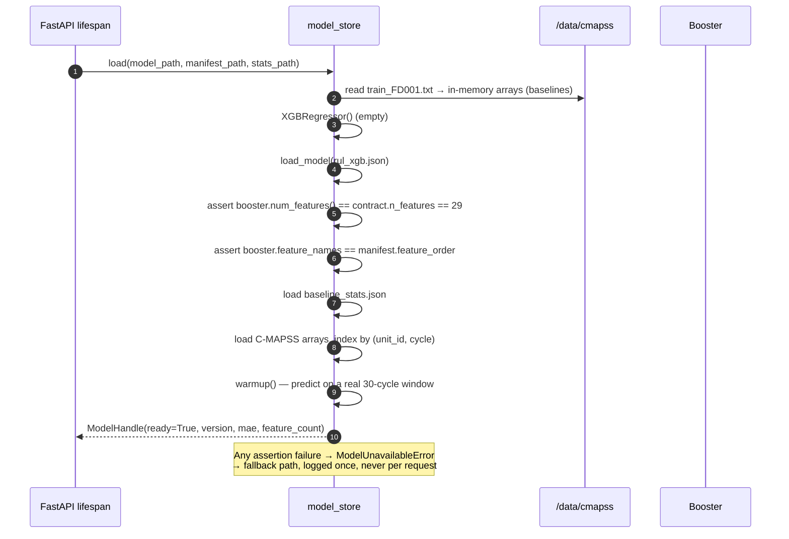

# 08 — ML Service

C-MAPSS in, RUL and component health out. Everything here runs **offline, in-process** —
no network, no separate inference server.

> **Which model is actually served.** This document describes the FD001 29-feature
> contract, which remains the reference and is still selectable via
> `FDT_ML_VARIANT=full`. The **default** is the pooled four-subset refit at **32
> features** (`FDT_ML_VARIANT=all`), which adds `regime_global`, `s10` and `s16`, and
> resolves baselines per subset. Read [15](15-serving-the-pooled-model.md) alongside
> this one — §3.2.1, §3.2 and §4 below describe the FD001 pipeline, and the differences
> that matter are called out there.

## 1. Current state of the model

`Model_training_249.ipynb` has two phases and **both now run to completion**. 29 cells:
13 for the FD001 serving model, 15 appended (cells 14–28) for multi-regime candidates.
See [12](12-model-training-pipeline.md) for the cell-by-cell walkthrough and
[13](13-multi-regime-training-report.md) for the Phase 2 results.

| Item | Status |
|---|---|
| Data loading, all four subsets | ✅ 26 columns, `sep=r"\s+"` |
| Constant-column removal | ✅ 7 dropped in FD001, 6 in FD003, 0 in FD002/FD004 |
| RUL label construction | ✅ `(max_cycle − cycle + 1)`, capped at 125 |
| Engine-level 80/20 split (no leakage) | ✅ `random_state=42`, overlap asserted |
| Rolling-5 features | ✅ mean **and** std, 6 sensors → 12 derived columns |
| XGBoost training | ✅ `n_estimators=1000`, depth 6, lr 0.05, early stopping |
| **Persisted model artifact** | ✅ `xgboost_fd001_rul.json` on Drive |
| **Scaler + feature contract** | ✅ `scaler_fd001.pkl`, `feature_contract.json` |
| **Metrics artifact** | ✅ `metrics_fd001.json` |
| **Baseline statistics** | ✅ per-regime median/MAD, cells 14–15 |
| **Cross-validated evaluation** | ✅ 5-fold grouped, all candidates |
| **Full-data refit** | ✅ all engines, rounds pinned from CV |
| **Component-health head (fan/hpc/hpt/lpt)** | ❌ not trained — derived from z-scores at inference |
| **Sensor deviation scores** | ❌ not trained — derived at inference from baselines |

### What is staged in `backend/`

| Variant | Width | Artifacts | Selected by |
|---|---:|---|---|
| `all` | **32** | `xgboost_all_full.json`, `feature_contract_all_full.json`, `regime_baselines_all.json`, `metrics_all_full.json` | `FDT_ML_VARIANT=all` (**default**) |
| `full` | 29 | `xgboost_fd001_full.json`, `feature_contract_fd001_full.json`, `regime_baselines_fd001.json` | `FDT_ML_VARIANT=full` |
| `holdout` | 29 | `xgboost_fd001_rul.json`, `feature_contract.json`, `scaler_fd001.pkl`, `baseline_stats.json` | `FDT_ML_VARIANT=holdout` |

Raw C-MAPSS for FD001–FD004 (`train`/`test`/`RUL`) is in `backend/data/cmapss/`. Only the
subset named by `FDT_ML_DATASET` (default `FD001`) is replayed. See
[15](15-serving-the-pooled-model.md).

### Measured performance

| Metric | Holdout (20 unseen engines) | Official test (100 engines) |
|---|---:|---:|
| MAE | **11.407** | 13.197 |
| RMSE | **16.049** | 18.365 |
| R² | **0.8494** | — |
| NASA asymmetric score | — | **0.4636** |

Cross-validated (5-fold, grouped by engine): **RMSE 17.988 ± 1.487**,
per-fold `[18.891, 18.693, 16.457, 19.874, 16.026]`.

Boosting stopped at **92 of 1000** rounds on the holdout, **83** on the full-data refit.
Feature importance is dominated by `s4_rollmean5` (0.473) and `s11_rollmean5` (0.219) —
T50 at the LPT outlet and static pressure at the HPC outlet, which are the sensors the
C-MAPSS literature identifies as degradation carriers. The top three features hold 77.1 %
of total gain.

The two ❌ items are not defects. Component health and sensor deviation are *derived* at
inference time from the per-sensor z-scores ([§6.3](#63-sensor-deviation-spec-46),
[§6.4](#64-component-health-spec-47)) rather than learned, so there is no separate head to
train. That was the design, not an omission.

## 2. Dataset choice

| Dataset | Engines | Conditions | Fault modes | Use |
|---|---:|---|---|---|
| **FD001** | 100 | 1 (sea level) | HPC | **Training and serving.** Matches the notebook, 100 units ≥ 8 aircraft needed |
| FD003 | 100 | 1 | HPC + Fan | Trained and measured. Pooling it into FD001 did **not** improve accuracy (18.42 vs 18.30), but it is the only single-regime model with fan coverage |
| FD002 | 260 | 6 | HPC | Regime normalisation **implemented and measured**. Official-test RMSE 28.57 — not serving-ready |
| FD004 | 248 | 6 | HPC + Fan | Regime normalisation **implemented and measured**. Official-test RMSE 29.96 — not serving-ready |

**FD001 is the serving dataset.** Reasons:

1. The trained model, the reported MAE, and the feature importances all come from FD001.
   Switching datasets invalidates every number the frontend has already been shown.
2. 100 engine units comfortably cover 8 aircraft with a 1:1 binding, with room to spare.
3. Single operating regime removes regime-normalisation risk from the critical path.

**Regime support is built, exercised, and disabled for serving.** Cells 14–15 assign each
row to one of the documented operating conditions (1 for FD001/FD003, 6 for FD002/FD004)
and compute per-regime median/MAD baselines; cell 17 z-scores against them. So the
mechanism is proven rather than hypothetical — but the measured result is negative: the
multi-regime models lose 10–13 cycles of RMSE under the official truncated-test protocol
relative to their own cross-validation, versus +0.3 for FD001. See
[13 §5](13-multi-regime-training-report.md).

`regime` is a column, a request field, and a parameter of the baseline statistics, so
enabling a multi-regime dataset later is a data swap, not a refactor. `FDT_ML_DATASET`
selects the dataset. **Note that the multi-regime models are trained on z-scored inputs and
ship no scaler**, unlike the FD001 model — the loader branches on
`feature_contract.requires_scaler`.

### Why RUL is capped at 125 when FD001 engines live 128–362 cycles

Not a data limitation — a product decision. See rule 26 in
[07](07-business-rules.md). Three effects: the demo reaches a critical state within a few
minutes of wall-clock replay; `do_by_cycle = rul − 10` stays in a readable range; and the
mission-ready threshold of 30 cycles has a meaningful window above it.

---

## 3. Feature contract

### 3.1 Sensor selection

Constant in FD001, dropped at training time:

```
setting_3, sensor_1, sensor_5, sensor_10, sensor_16, sensor_18, sensor_19
```

14 informative sensors plus `s6`:

```
s2, s3, s4, s6, s7, s8, s9, s11, s12, s13, s14, s15, s17, s20, s21
```

> The original spec (item 45) lists 14 and omits `s6`. `s6` is non-constant in FD001
> (mean 21.6098, variance 1.93e-06, importance 0.0160) and is retained. The wire contract
> is unchanged — see [01 §3](01-requirements-evaluation.md) for the full reconciliation and
> the `s6_imputed` flag.

### 3.2 The 29 model features

This is the contract the trained model actually expects. It is emitted by
`feature_contract.json` on Drive and asserted against `booster.num_features()` at load.

```python
FEATURE_ORDER = [
    "op1", "op2",                                                    #  2  operating settings
    "s2","s3","s4","s6","s7","s8","s9",                              #  7
    "s11","s12","s13","s14","s15","s17","s20","s21",                #  8  = 15 sensors
    "s11_rollmean5","s11_rollstd5",                                  #  2
    "s4_rollmean5","s4_rollstd5",                                    #  2
    "s9_rollmean5","s9_rollstd5",                                    #  2
    "s12_rollmean5","s12_rollstd5",                                  #  2
    "s14_rollmean5","s14_rollstd5",                                  #  2
    "s7_rollmean5","s7_rollstd5",                                    #  2
]                                                                  # = 29
```

Order is **fixed and asserted against `feature_contract.json` at load time**. XGBoost
consumes a positional matrix; a silently reordered feature list produces plausible-looking
but wrong predictions, which is the worst failure mode available.

> **`cycle` is NOT a feature.** An earlier iteration of the notebook included it, where it
> was the single most important column at 0.3585. That is a leakage artefact: the official
> test set is truncated early, so cycle count correlates with RUL in a way that does not
> hold on real data. Removing it costs very little (validation RMSE is 16.05 without it)
> and keeps the model honest. `cycle` is still tracked per aircraft and used for the
> fallback and for absolute-cycle assignment — it is simply not a model input.

`op1` and `op2` are constant in some single-regime contexts but are fed to the model
regardless, matching the training pipeline; XGBoost never splits on a constant column, so
they cost nothing and keep the contract identical across datasets.

### 3.2.1 Preprocessing: two variants

| Model | Input transform | Artifact |
|---|---|---|
| FD001 serving (`xgboost_fd001_rul.json`) | `StandardScaler` over the raw 29 columns | `scaler_fd001.pkl` — `requires_scaler: true` |
| Phase 2 candidates (`models/multi/`) | per-regime z-score `(x − median) / MAD`, then rolling stats | `regime_baselines_<tag>.json` — `requires_scaler: false` |

For FD001 the two are equivalent up to a per-column affine transform, which is why the
Phase 2 single-regime model reproduces the 29-feature contract exactly. **The loader must
branch on `requires_scaler` rather than assuming one pipeline.**

### 3.3 Rolling features

```python
ROLLING_SENSORS = ["s11", "s4", "s9", "s12", "s14", "s7"]
WINDOW = 5      # min_periods=1, so the first rows are defined
SUFFIXES = ["_rollmean5", "_rollstd5"]     # both, 6 sensors -> 12 derived columns
```

Computed within the submitted 30-cycle window, oldest to newest. Rolling statistics capture
the *rate* of degradation, which raw snapshots do not — a sensor that has drifted 8 units
over 5 cycles is more informative than its current absolute value.

The evidence that this is where the signal lives: `s4` on its own carries 0.023 of the gain,
while `s4_rollmean5` carries **0.473** — the single most important feature in the model.
The rolling standard deviation is retained because it separates steady degradation from a
noisy but healthy reading.

### 3.4 Window requirements

| Window size | Behaviour |
|---|---|
| 30 | Normal. Full 29 features. |
| 5–29 | Accepted. Rolling means computed over what is available. |
| < 5 | `422` — not enough context |
| > 30 | Truncated to the most recent 30 |

---

## 4. Artifacts

Trained artifacts live on **Google Drive**, not in the repo — they are large, and Drive
is what the notebook writes to:

```
MyDrive/Project2/cmapss/
├── raw/            13 untouched NASA .txt files
├── clean/          8 cleaned CSVs (gzip) + manifest.json
└── models/
    ├── xgboost_fd001_rul.json     SERVING model
    ├── scaler_fd001.pkl           StandardScaler + feature order
    ├── metrics_fd001.json         holdout + official-test metrics
    ├── feature_contract.json      sensor/feature order, exclusions
    └── multi/                     Phase 2 candidates (see 13)
```

### Serving artifacts

**`xgboost_fd001_rul.json`** — native XGBoost JSON, no ONNX conversion. Benefits that matter
here: `get_score(importance_type="gain")` stays available for the top-sensors endpoint (ONNX
would not provide it), and there is no converter in the build path to break.

> Trained on 80 of 100 engines (the holdout feeds early stopping). A full-data refit trained
> on all 100 exists at `models/multi/xgboost_fd001_full.json` — same recipe, same 29
> features, 83 rounds, official-test RMSE 18.30 versus 18.365. See
> [13 §8](13-multi-regime-training-report.md).

**`scaler_fd001.pkl`** — `{"scaler": StandardScaler, "features": [...]}`. The model was
trained on standardised inputs; the booster alone cannot reproduce its own predictions.

**`feature_contract.json`**

```json
{
  "model_file": "xgboost_fd001_rul.json",
  "sensor_order": ["s2","s3","s4","s7","s8","s9","s11","s12","s13","s14","s15","s17","s20","s21"],
  "feature_order": ["op1","op2","s2","…","s7_rollstd5"],
  "operating_settings": ["op1","op2","op3"],
  "excluded": ["unit","cycle","RUL"],
  "roll_window": 5,
  "rul_cap": 125,
  "requires_scaler": true,
  "scaler_file": "scaler_fd001.pkl"
}
```

**`metrics_fd001.json`** — grouped-validation and official-test metrics, hyperparameters,
`best_iteration`, and the exact roll sensors and cap used.

**`baseline_stats.json`** — per-sensor **median and MAD** over each unit's first 20 healthy
cycles, keyed by regime. Median/MAD rather than mean/std because C-MAPSS sensors have heavy
tails during degradation, and a single early spike would inflate σ and flatten every
subsequent z-score.

```json
{
  "healthy_window_cycles": 20,
  "regime_0": {
    "s2":  { "median": 642.68, "mad": 0.21 },
    "s3":  { "median": 1590.52, "mad": 3.10 },
    "s11": { "median": 521.93, "mad": 1.44 }
  }
}
```

For the serving FD001 model there is exactly one regime, so the `regime_0` key is the whole
file. The Phase 2 artifacts carry one block per regime plus the centroids needed to assign
a new observation to a regime.

### Generation

```bash
# interactive / Colab — writes everything to Drive
colab exec -f Model_training_249.ipynb --timeout 900 -s <session>
```

Phase 0 task 0.1 (port to `backend/scripts/train_rul.py`) is **not** done. The script exists
but trains a *different and weaker* model — 16 features, `cycle` included, RUL uncapped,
rolling means only, MAE 23.94. It must be reconciled with the notebook contract above before
it becomes the source of truth.

## 5. Model lifecycle



Loaded **once**, during the lifespan, before the server accepts traffic. Guarded by a
`threading.Lock` so a concurrent first request cannot trigger a second load. The warmup call
matters: XGBoost's first prediction after `load_model` is measurably slower than
subsequent ones, and without it the very first dashboard request absorbs that cost.

`Booster.predict` releases the GIL, so inference runs in a `ThreadPoolExecutor` rather than
blocking the event loop during a WebSocket tick storm.

---

## 6. Inference

### 6.1 Pipeline

```
30-cycle window
  → absolute cycle assignment          (cycle ← aircraft.current_cycle − offset + i)
  → s6 imputation if absent            (s6 = 21.61, flag s6_imputed)
  → regime = nearest centroid on (setting_1, setting_2, setting_3)
  → build 29-feature matrix            (assert column order == feature_contract)
  → StandardScaler.transform           (serving model; regime baselines for Phase 2)
  → Booster.predict → rul_raw
  → cap_rul(rul_raw)                   (rule 26: clamp [0, 125])
  → component health from z-scores     (spec 47 grouping)
  → EMA smoothing over cycles          (α = 0.3)
  → top_sensors = blend(gain, |z|)     (top 5)
```

### 6.2 RUL prediction

```python
matrix = np.array([feature_row(w) for w in window], dtype=np.float32)
rul_raw = float(booster.predict(matrix)[-1])     # last cycle only
rul = cap_rul(rul_raw)                            # rule 26
rul_capped = rul_raw > RUL_CAP
```

The window is passed as a matrix but the **last row's prediction** is used, since the goal
is the current cycle's RUL. Running all 30 rows costs the same ~2 ms and yields a
diagnostic: comparing predicted vs. actual degradation slope across the window reveals
model drift. The comparison is logged, not returned.

### 6.3 Sensor deviation (spec 46)

```python
z        = (value − baseline_median) / max(baseline_mad, EPS)
score    = clip(abs(z), 0, 10) / 10        # ∈ [0, 1]
```

`EPS = 1e-6` guards the near-constant sensors (`s6` MAD is tiny). All 15 sensors get a
score, including those outside any component group — the frontend receives the full picture
rather than only the mapped subset.

### 6.4 Component health (spec 47)

Grouping exactly as specified:

| Component | Sensors |
|---|---|
| fan | s8, s13 |
| hpc | s3, s7, s11 |
| hpt | s20, s21 |
| lpt | s4 |

```python
health_c = 1 − clip( mean(|z_s| for s in map[c]) / 3.0, 0, 1 )
```

The `/3.0` divisor means a mean |z| of 3 (three robust standard deviations from healthy)
drives the component to 0.0. Calibrated against FD001's degradation tail, where
`HPC degradation` (the FD001 fault mode) pushes `s11` past 3σ by roughly 40 cycles before
failure — so health reaches 0 close to true end-of-life without collapsing early.

**Unassigned sensors** (`s2, s6, s9, s12, s14, s15, s17` — 7 of 15) are excluded from
component health, exactly as the spec dictates. They still contribute to `top_sensors` and
to engine-level health. `component_sensor_map` is returned in every response so the frontend
never hard-codes the mapping.

### 6.5 Smoothing

```python
smoothed = α × raw + (1 − α) × previous,   α = 0.3
```

C-MAPSS sensors are noisy cycle to cycle; unsmoothed component health flickers between
0.61 and 0.66 and the dashboard cannot settle on a colour. α = 0.3 responds to real
degradation within ~5 cycles while suppressing single-cycle noise. State is per
`(aircraft_id, component)` and resets on loop wrap.

### 6.6 Top sensors

```python
gain  = booster.get_score(importance_type="gain")      # global, from the manifest
score = 0.6 × normalised_gain(s) + 0.4 × deviation_score(s)
top_sensors = sorted(all 15, key=score, reverse=True)[:5]
```

Blending the model's global gain with the current deviation means a sensor that is
*important in general* but *quiet right now* does not outrank one that is both important
**and** actively deviating. Using gain alone would show the same five sensors for every
aircraft at every cycle, which is not useful.

---

## 7. Engine health derivation

C-MAPSS has no health column. Health is derived from RUL, which is the physically
meaningful quantity:

```python
health_engine = clip(rul / 125, 0, 1)
```

Consistent by construction: health is 1.0 at the cap and 0.0 at failure. Risk bands then
follow from rule 19 without a second calibration, and `health` and `rul` can never
contradict each other in a response.

**Cross-check against the drive data.** `component_ref` gives an independent estimate:

```python
implied_health = 1 − operating_cycles / life_limit_cycles
```

Seed compares the two per aircraft and logs any divergence > 0.25 to
`seed_reconciliation.log`. No automatic override — the model remains the source of truth
for the engine, per the decision that ML is C-MAPSS-only.

---

## 8. Non-engine parts

Radar, gear, hydraulics and fuel have **no sensor source in either dataset**, and per the
project decision no synthetic values are invented. They derive from real maintenance
burden — the full derivation is in [01 §4](01-requirements-evaluation.md). Summary:

```
health(a, p) = clamp( 1 − E_norm(a, p), 0.05, 1.0 )

E(a, p) = Σ over records of  fault_weight(fault_type) × recency_weight(date)
                                × downtime_hours / 100
        + Σ over snags of    severity_weight × recency_weight / 10
```

Every affected response carries `simulated: true` and `method: "maintenance_burden_v1"`.
Only `engine` carries `simulated: false`.

---

## 9. Fallback

The demo must never fail because an artifact is missing.

```python
def fallback_rul(current_cycle: int, cap: int = 125) -> int:
    return clip(cap - current_cycle, 0, cap)
```

Triggered when: the artifact is absent or corrupt, the feature-count assertion fails, the
manifest disagrees with the booster, or the window is too short to build features.

Every fallback response carries:

```json
{ "model": { "version": "fallback", "fallback": true, "s6_imputed": false } }
```

The frontend renders a subtle "estimated" chip — **not** an error state. Component health
degrades linearly at 1/125 per cycle. The fallback is logged **once** at startup, not on
every request, so a persistent misconfiguration is still visible in the logs without
flooding them.

`FDT_ML_FALLBACK=false` turns this into a `503 ModelUnavailableError` — useful in CI, where
silently degrading would let a broken model pass the pipeline.

---

## 10. Performance

Budget from spec 50: **under 100 ms** for the ML call.

| Step | Typical | Notes |
|---|---:|---|
| Window fetch (30 rows) | 0.4 ms | Indexed range scan |
| Feature construction | 0.25 ms | Pure Python, 29 columns |
| `Booster.predict` | **1.0–1.8 ms** | 83 trees (full-data refit), depth 6, single row |
| Deviation + z-scores | 0.1 ms | 15 sensors |
| Component health + EMA | 0.05 ms | 4 components |
| Attribution / top sensors | 0.2 ms | `get_score` cached at load |
| **Total** | **≈ 3 ms** | ~30× headroom |

`latency_ms` is written to `ml_prediction` on every prediction, so the budget is verifiable
from the database after a demo run rather than merely asserted:

```sql
SELECT model_version,
       COUNT(*),
       ROUND(AVG(latency_ms), 2)  AS avg_ms,
       ROUND(MAX(latency_ms), 2)  AS max_ms,
       COUNT(*) FILTER (WHERE latency_ms > 100) AS budget_violations
FROM ml_prediction
GROUP BY model_version;
```

`budget_violations` must be 0. A performance test asserts it.

---

## 11. Model quality gate

`tests/ml/test_model_quality.py`, run in CI:

| Assertion | Threshold | Basis |
|---|---|---|
| MAE on the FD001 validation split | ≤ 14.0 | Measured 11.407 |
| RMSE | ≤ 20.0 | Measured 16.049 |
| R² | ≥ 0.80 | Measured 0.8494 |
| Cross-validated RMSE (5-fold, grouped) | ≤ 21.0 | Measured 17.988 ± 1.487 |
| Engine-level split only | mandatory | Row-level splits leak, since adjacent cycles are near-identical |
| Predicted RUL within `[0, 125]` | 100 % | Rule 26 |
| Component health within `[0, 1]` | 100 % | DB `CHECK` constraint |
| `p95(latency_ms) < 100` | mandatory | Spec 50 |
| Determinism | mandatory | Same input → same output, 100 runs |

**Split discipline.** The split is by `unit_id`, never by row. Row-level splitting puts
adjacent cycles of the same engine in both sets; since consecutive C-MAPSS cycles are nearly
identical, that inflates R² and can push MAE into single digits while learning nothing. The
notebook's 80/20 engine split is correct and must be preserved.

**Thresholds were tightened from the original Phase 0 plan**, which set MAE ≤ 25.0,
RMSE ≤ 35.0 and R² ≥ 0.70 against a then-baseline of 23.94 / 31.59 / 0.768. The model now
clears that old gate by a wide margin, so the gate was moved to roughly MAE +2.5 cycles and
R² +0.1 above what is actually achieved. A gate that passes by 50 % tests nothing. The
looser numbers should not be restored: they were sized for a model that no longer exists.

---

## 12. Retraining

**Today the notebook is the only trainer.**

```bash
colab exec -f Model_training_249.ipynb --timeout 900 -s <session>
python -m pytest tests/ml/ -v
```

`backend/scripts/train_rul.py` exists and is CLI-driven, but it does not yet reproduce the
serving model — it emits 16 features including `cycle`, with RUL uncapped and no rolling
standard deviation (MAE 23.94 against the notebook's 11.41). Reconciling it is Phase 0 task
0.1 and is the blocking item for reproducible training; until then the model can only be
regenerated by running the notebook.

`model_version` in the feature contract and in every `ml_prediction` row makes it possible to
serve two model generations side by side and compare their predictions after a deploy.