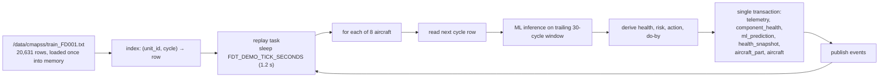
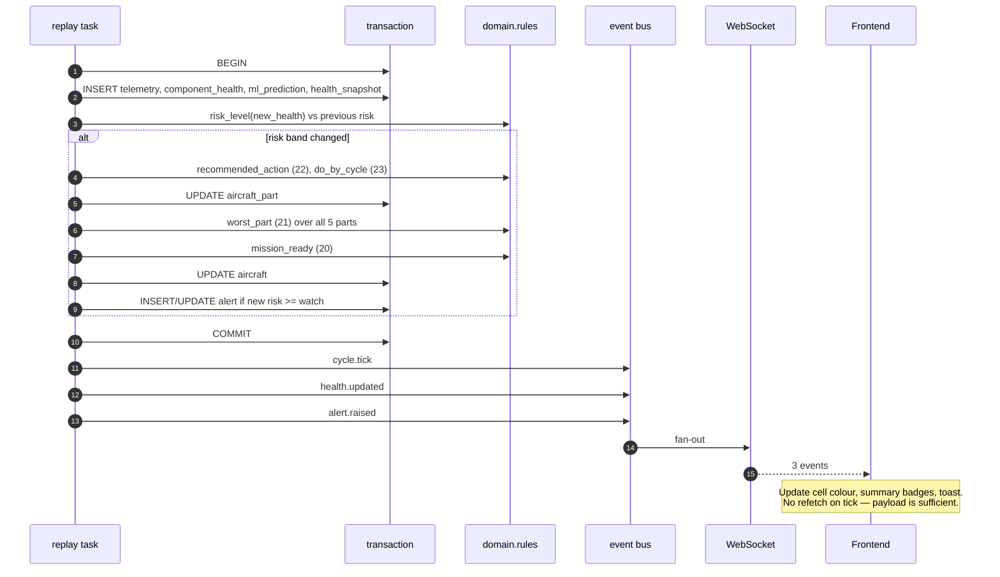

# 09 — Realtime & Demo Mode

Spec items 42 and 43. The WebSocket stream and the C-MAPSS replay engine that drives it.

---

## 1. Replay engine

### 1.1 Purpose

A demo with no live sensor feed would show a frozen dashboard. The replay engine advances
every aircraft by one C-MAPSS cycle every 1.2 seconds, runs the real ML inference on each
step, writes the real database rows, and pushes the real events — so the WebSocket and the
REST API are driven by the identical code path that production telemetry would use. Nothing
about the replay is special-cased downstream.



### 1.2 Loop and wrap

FD001 engines run 128–362 cycles. On reaching an engine's last cycle the replay **wraps
back to `ml_window` (30)** rather than stopping — see the note below on why not 1.

The wrap is the part that needs care. Three things must be reset or the demo visibly breaks:

1. **Cycle number** → back to 30 (`ml_window`). Wrapping to 1 was tried first and is wrong:
   it hands `cmapss.window` a single row, `build_window` rejects anything under five cycles,
   and so the first four ticks after every wrap were silently answered by the
   `rul = 125 - cycle` fallback instead of the model. Restarting at `ml_window` skips
   cycles 1–29 — the least informative ones, all healthy and well above the RUL cap — and
   buys a complete feature window, so every prediction is model-backed. The engine is still
   walked to genuine end of life first.
2. **EMA state** → cleared, otherwise the new trajectory's health starts from the previous
   engine's final (near-zero) value and takes ~10 cycles to climb back, showing a
   resurrection curve that looks like a bug.
3. **RUL** → back to 125 via the normal prediction path, not a special case.

Nothing else needs resetting: risk, alerts, work orders, spares and bookings are operational
state that legitimately persists across a replay loop.

The wrap is **instantaneous** — cycle *N* is immediately followed by cycle 30 of the same
engine. No pause, no fade.

### 1.3 Staggered start offsets

If all 8 aircraft started at cycle 1, they would degrade in near-lockstep and all cross into
critical within a few ticks — an unconvincing demo where the whole fleet goes red at once.

```sql
-- seeded by the demo_offset column on aircraft
Fighter-01 → unit 1,  offset 0
Fighter-02 → unit 2,  offset 30
Fighter-03 → unit 3,  offset 60
Fighter-04 → unit 4,  offset 90
Fighter-05 → unit 7,  offset 120
Fighter-06 → unit 12, offset 150
Fighter-07 → unit 18, offset 30
Fighter-08 → unit 24, offset 60
```

Engines are chosen for **spread of remaining life** (units 1, 2, 3, 4, 7, 12, 18, 24 have
EOL cycles roughly 192, 287, 179, 189, 259, 202, 246, 222), and offsets are staggered so
aircraft enter critical at visibly different times. The dashboard therefore shows a fleet
with a genuine spread: some healthy, some on watch, one or two critical.

### 1.4 Tick implementation

```python
async def _tick(self) -> None:
    for aircraft in self.active_aircraft:          # 8 rows, cached at start
        row = self.cmapss.next_row(aircraft.cmapss_unit_id, aircraft.current_cycle + 1)
        if row is None:
            aircraft.current_cycle = self._resume_cycle(aircraft.cmapss_unit_id)  # 30
            self.ml.reset_ema(aircraft.id)         # clears EMA state
            row = self.cmapss.next_row(aircraft.cmapss_unit_id, aircraft.current_cycle)

        window = self.cmapss.window(aircraft.cmapss_unit_id, 30)   # trailing 30
        pred = await self.loop.run_in_executor(self.ml.predict, window)

        async with self.uow() as tx:               # ONE transaction per aircraft-tick
            await self.persist(tx, aircraft, row, pred)
            await self.recompute_derived(tx, aircraft)   # rules 19–26

        await self.bus.publish(Event.cycle_tick(cycle=aircraft.current_cycle))
        await self.bus.publish(Event.health_updated(...))
        if alert:
            await self.bus.publish(Event.alert_raised(...))

    await asyncio.sleep(self.interval)             # 1.2 s
```

Four properties matter here:

- **One transaction per aircraft-tick.** All writes for a tick commit together *before* any
  event is published, so a client can never see `cycle.tick` for cycle *n* next to a
  `health.updated` still describing cycle *n−1*.
- **One sleep per full fleet pass, not per aircraft.** Sleeping inside the loop would make a
  tick 8 × 1.2 = 9.6 s.
- **Inference off the event loop.** `run_in_executor` keeps the WebSocket responsive during
  a tick; 8 × 3 ms is negligible but the pattern matters if the fleet grows.
- **Tick work is idempotent.** `ON CONFLICT (aircraft_id, cycle) DO UPDATE` means a manual
  tick replayed over the same cycle produces the same state.

### 1.5 Timing

| Setting | Value | Effect |
|---|---|---|
| `FDT_DEMO_TICK_SECONDS` | `1.2` | Spec 43. One fleet pass per 1.2 s |
| Per-aircraft work | ~3 ms inference + ~4 ms DB | 8 × 7 = **56 ms** |
| Idle | ~1,144 ms | 95 % duty-cycle headroom |
| Writes per tick | 8 × (telemetry, component_health, ml_prediction, health_snapshot) + updates | ~32 inserts + ~16 updates |

A full pass costs ~56 ms against a 1,200 ms budget. Even a 20× fleet growth would fit.

### 1.6 Controls

| Endpoint | Effect |
|---|---|
| `POST /api/v1/demo/tick` | Advance one cycle now, then pause the loop |
| `POST /api/v1/demo/pause` | Stop auto-advancing; WebSocket stays open |
| `POST /api/v1/demo/resume` | Resume at the configured interval |
| `GET /api/v1/demo/status` | Tick count, per-aircraft cycle and loop count, connected sockets |

Control is commander-only. Pausing without disconnecting is deliberate — a commander
narrating the demo needs to freeze the fleet and point at a specific cell, not lose the live
view.

---

## 2. Event bus

In-process `asyncio` fan-out. One API process, so Redis would be infrastructure with no
consumer.

```python
class EventBus:
    def __init__(self) -> None:
        self._subscribers: set[asyncio.Queue] = set()

    async def publish(self, event: Event) -> None:
        for q in list(self._subscribers):
            try:
                q.put_nowait(event)
            except asyncio.QueueFull:
                self._drop(q)        # slow consumer: drop, then disconnect
```

**Slow-consumer policy.** Each subscriber gets a bounded queue (256). A client that cannot
keep up has events dropped rather than being allowed to grow memory without limit; on
overflow the socket is closed with `1013 Try again later` so the client reconnects with
fresh state instead of silently missing alerts. Silent drops would be worse than a visible
disconnect.

The close needs the overflow to be *communicated*, not just inferred: discarding the queue
from the fan-out leaves the consumer's drain task waiting on `queue.get()` forever, so the
socket stays open, the client keeps showing "Backend Live", and the numbers simply freeze —
a full socket never trips the false→true transition that triggers a REST resync. So
`EventBus.publish` also pushes an `OVERFLOW` sentinel into the offending queue (evicting one
queued event to make room), and `ws.drain()` turns it into the `1013` close.

**Aircraft filters do not apply to fleet-wide events.** `spare.reserved` and `alert.acked`
carry no `aircraft` key, so a subscriber filtered to some aircraft must still receive them —
a filter narrows the per-aircraft stream, it does not suppress the whole company.

---

## 3. WebSocket protocol

### 3.1 Connection

```
wss://host/ws/fleet?token=<JWT>
```

The token is a **query parameter** because browsers cannot set headers on a WebSocket
handshake. Mitigation: `wss://` in production so the query string is encrypted in transit;
the token has a bounded TTL; `GET /alerts` and all read endpoints require the same
`Authorization` header anyway, so a leaked URL token grants nothing beyond what is already
public to that user.

Query parameters: `token` (required), `aircraft` (optional comma-separated filter).

```json
{ "type": "connection.ready",
  "payload": { "aircraft": 8, "demo_mode": true, "tick_seconds": 1.2,
               "server_time": "2026-10-03T11:27:00Z", "protocol_version": 1 } }
```

`connection.ready` carries enough for the client to render its initial view before the
first tick, so there is no dead period after connecting.

### 3.2 Server → client events

| Type | Payload | Frequency |
|---|---|---|
| `connection.ready` | connection metadata | once |
| `cycle.tick` | `{cycle, ts}` | 1 per 1.2 s |
| `health.updated` | `{aircraft, part, health, risk, rul}` | on change |
| `alert.raised` | `{id, aircraft, part, level, message}` | on transition |
| `alert.acked` | `{id, acked_by, acked_at}` | on ack |
| `work_order.created` | full work order | on create |
| `work_order.updated` | `{reference, status, …}` | on patch |
| `spare.reserved` | `{part_ref_id, stock_remaining}` | on reserve |
| `booking.created` | `{agency, eta_date, back_in_service_days}` | on book |
| `pong` | `{}` | on ping |

```json
{ "type": "health.updated",
  "payload": { "aircraft": "Fighter-06", "aircraft_id": 6, "part": "engine",
               "health": 0.312, "risk": "critical", "rul": 24,
               "cycle": 38, "ts": "2026-10-03T11:27:04Z" },
  "seq": 4821 }
```

`seq` is a monotonic per-connection counter. After a reconnect the client refetches
`/fleet/summary` rather than attempting to replay missed events — cheaper and less
error-prone than gap detection.

### 3.3 Client → server

```json
{ "type": "subscribe",   "payload": { "aircraft": ["Fighter-01", "Fighter-06"] } }
{ "type": "unsubscribe", "payload": { "aircraft": ["Fighter-02"] } }
{ "type": "ping",        "payload": {} }
```

`ping` → `pong` within one interval. The client sends one `ping` when the socket opens and
relies on uvicorn's protocol-level keepalive (20 s / 20 s) after that; there is no repeating
app-level ping. The server additionally re-checks the token every 30 s, so a socket whose
credential has since expired is closed with `4401` even when no events are flowing.

Subscriptions are per-connection server state. The client remembers its filter and re-sends
`subscribe` in `onopen`, because a reconnect otherwise starts from "everything" and a filter
would silently stop filtering after one dropped connection.

### 3.4 Close codes

| Code | Reason | Client action |
|---|---|---|
| `1000` | Normal | No action |
| `1001` | Server going away | Reconnect |
| `1011` | Internal error | Reconnect with backoff |
| `1013` | Try again later (slow consumer / queue overflow) | Reconnect, then refetch state |
| `4401` | Invalid or expired token | Re-authenticate first |
| `4408` | Origin not in the CORS allowlist | Fix configuration |

### 3.5 Reconnection

Client-side, exponential backoff: 1 s → 2 s → 4 s → 8 s → 16 s → 30 s cap, with jitter.
After every reconnect the client calls `GET /fleet/summary` and `GET /alerts` to resync,
because events missed while disconnected cannot be replayed.

The server keeps no per-connection history — for 8 aircraft and 1.2 s ticks, a resync is one
cheap HTTP call and far simpler than an event log.

---

## 4. Interaction with derived state



**Frontend performance rule.** Do not refetch `/fleet/summary` on every tick. The event
payloads carry the changed values. Refetching at the 1.2 s tick rate would make the backend
look slow when it is not.

**The socket is an overlay, not a replacement for the read API.** The fleet-wide read
endpoints are still polled, on a 3 s interval; the socket exists to remove the *extra* latency
on the handful of values that move every tick, plus the per-prediction ML provenance that no
read endpoint carries. Where both channels deliver the same field, the socket wins if it is
newer: a poll response issued at *t* can arrive after a `health.updated` that is already
fresher, and letting it overwrite would visibly rewind the cycle counter.

Alerts get their own, slower 10 s poll, because they move on *other* operators' clocks and
`alert.raised` only fires when this process raises one.

**Only engine health changes per tick.** The other four parts derive from maintenance
history, which does not move during a replay tick, so they are written once at seed. Their
`health.updated` events fire only when `POST /telemetry` or a seed re-run changes them —
a meaningful reduction in event volume.

---

## 5. Failure modes

| Failure | Behaviour |
|---|---|
| Model artifact missing | Fallback prediction, `model: "fallback"` in the payload, one startup log line |
| DB write fails on one aircraft | That aircraft's tick is skipped and logged; the other 7 continue; the loop keeps running |
| DB unreachable | Ticks pause with backoff; `healthz` reports `db: false`; the WebSocket stays open and the client shows a stale-data banner |
| WebSocket client disconnects mid-tick | The registry drops it; publishing continues for everyone else |
| Queue overflow | Close with `1013`; client reconnects and resyncs |
| C-MAPSS file missing | Replay disabled at startup, `healthz` reports `replay: false`, REST endpoints still serve the seeded state |
| Two API instances | Each runs its own replay loop and they double-advance. **Compose is single-instance by design** — scaling out requires promoting an external telemetry source and setting `FDT_DEMO_MODE=false` |

The last row is the one real scaling constraint, and it is a consequence of demo mode, not
of the architecture: with an external telemetry feed there is exactly one writer per cycle
and horizontal scaling becomes unremarkable.

---

## 6. Realtime requirement traceability

| Spec | Requirement | Implementation |
|---|---|---|
| 42 | `WebSocket /ws/fleet` | §3.1 |
| 42 | `cycle.tick` event with cycle number | §3.2 |
| 42 | `health.updated` with aircraft, part, health | §3.2 |
| 42 | `alert.raised` | §3.2 |
| 43 | Advance one cycle every 1.2 s | §1.4, `FDT_DEMO_TICK_SECONDS` |
| 43 | Replay C-MAPSS data | §1.1 |
| 43 | Wrap at end of life so it loops | §1.2 |
| 8 | Offline, no external calls | C-MAPSS loaded from a local file at startup |
| 50 | GET under 200 ms | Events carry the data, so no refetch is needed per tick |