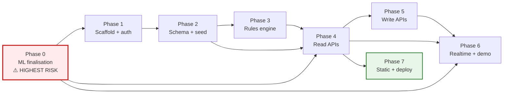

# 10 — Development Plan

Eight phases, ordered by dependency risk rather than convenience. Each phase has a scope,
deliverables, exit criteria that can be mechanically checked, and an estimate.

## Phase dependency graph

Phase 3 and Phase 4 can run in parallel once Phase 2 lands — the rules engine needs no
database, and the read APIs need only the rules' signatures. Phase 0 should start
immediately and in parallel with everything, since it is the only phase that can invalidate
downstream work.

---

## Phase 0 — ML finalisation

**Why first.** The notebook currently produces a good RUL model and nothing else. Items 46
and 47 (sensor deviation, component health) have no implementation, the `top_sensors` field
in three endpoint contracts depends on `get_score`, and Phase 6's replay has nothing to
replay through. Every hour spent elsewhere is an hour spent building against a contract
that may change.

| Task | Detail |
|---|---|
| 0.1 | Convert the notebook to `scripts/train_rul.py` — importable, CLI-driven, no Colab dependency |
| 0.2 | Finish rolling-5 feature engineering on the full train/test trajectories |
| 0.3 | Retrain on the 29-feature set; record MAE/RMSE/R² on the engine-level 80/20 split |
| 0.4 | `booster.save_model("models_artifacts/rul_xgb.json")` |
| 0.5 | Emit `feature_manifest.json` — feature order, dataset, metrics, importance, version |
| 0.6 | Compute `baseline_stats.json` — per-sensor median/MAD over each unit's first 20 cycles |
| 0.7 | Implement `ml/features.py` — window → 29-column matrix, with an order assertion |
| 0.8 | Implement `ml/inference.py` — RUL + cap + component health + EMA |
| 0.9 | Implement `ml/attribution.py` — z-scores, gain blend, top 5 |
| 0.10 | Implement `ml/fallback.py` — `rul = 125 − cycle` |
| 0.11 | Write `tests/ml/test_model_quality.py` — the gate in [08 §11](08-ml-service.md) |

**Status as of this writing.** Tasks 0.2–0.6 are effectively delivered by
`Model_training_249.ipynb` (rolling mean **and** std, 29 features, grouped split, metrics,
feature contract, per-regime baselines) — but only as notebook output on Drive, not as the
committed artifacts in `models_artifacts/`. Task 0.1 is the real blocker: the script still
trains a 16-feature variant with `cycle` included and RUL uncapped (MAE 23.94 against the
notebook's 11.41). See [08 §12](08-ml-service.md).

**Exit criteria**

- [ ] `python scripts/train_rul.py` regenerates all three artifacts from scratch
- [ ] MAE ≤ 14.0, RMSE ≤ 20.0, R² ≥ 0.80 on the FD001 validation split (tightened; see [08 §11](08-ml-service.md))
- [ ] Split is by `unit_id`, never by row
- [ ] `booster.num_features() == feature_contract.n_features == 29`
- [ ] 5-fold grouped CV RMSE ≤ 21.0 (currently 17.988 ± 1.487)
- [ ] Deterministic: 100 identical inputs → 100 identical outputs
- [ ] Component health within `[0, 1]` for all 20,631 FD001 rows
- [ ] `p95(latency_ms) < 100`
- [ ] Fallback returns a valid capped RUL with no artifact present

**Estimate:** 2–3 days. **Risk:** HIGH — if MAE cannot be recovered after the feature
change, the feature set must be renegotiated, which changes three endpoint contracts.

---

## Phase 1 — Scaffold and authentication

| Task | Detail |
|---|---|
| 1.1 | `app/` layout per [02 §3](02-backend-architecture.md) |
| 1.2 | `core/config.py` — pydantic-settings, `FDT_` prefix, no direct `os.environ` reads |
| 1.3 | `core/security.py` — bcrypt cost 12, HS256 issue/verify, 720 min TTL |
| 1.4 | `core/deps.py` — `get_db`, `get_current_user`, `require_roles(...)` |
| 1.5 | `core/errors.py` — domain exceptions → HTTP mapping |
| 1.6 | `core/logging.py` — structured JSON, `request_id` middleware |
| 1.7 | CORS with an explicit origin allowlist |
| 1.8 | `POST /auth/login`, `GET /auth/me` |
| 1.9 | Router-level RBAC dependency (viewer denied all mutations structurally) |
| 1.10 | `GET /healthz`, `GET /readyz` |
| 1.11 | `pyproject.toml`, `ruff`, `mypy`, `pytest` config |

**Exit criteria**

- [ ] `/docs` renders; `/openapi.json` is valid
- [ ] Login returns a role-bearing token; `GET /auth/me` echoes the role
- [ ] Expired token → 401; viewer on a mutation → 403; the two are distinguishable
- [ ] Every response carries `X-Request-ID`, matching the log line
- [ ] `mypy --strict` clean on `core/` and `domain/`
- [ ] No outbound network call anywhere in the codebase

**Estimate:** 1–2 days. **Risk:** LOW.

---

## Phase 2 — Schema and seed

| Task | Detail |
|---|---|
| 2.1 | Alembic scaffolding, naming convention, 9 revisions per [05 §10](05-database-design.md) |
| 2.2 | ORM models for all 20 tables |
| 2.3 | `db/unit_of_work.py` — transaction boundary + mandatory audit write |
| 2.4 | Loader per Drive CSV — 8 loaders, each upserting on its natural key |
| 2.5 | `seed/derived.py` — non-engine health, agency free slots, work orders, alerts |
| 2.6 | `seed/cmapss.py` — load FD001, bind 8 aircraft to 8 engine units with staggered offsets |
| 2.7 | `seed/run.py` — idempotent orchestrator, reports row counts |
| 2.8 | 3 demo users — `commander`, `officer`, `viewer` |
| 2.9 | `seed_reconciliation.log` — ML health vs. `component_ref` life-fraction cross-check |

**Exit criteria**

- [ ] `alembic upgrade head` on an empty database produces the schema in [05](05-database-design.md)
- [ ] Seed loads 100 aircraft_ref, 600 component_ref, 3,300 flight_ops, 1,500 records,
      800 snags, 6 agencies, 40 spares, 8 aircraft, 40 aircraft_part, 600 work orders
- [ ] Seed is idempotent — running twice changes no row count
- [ ] Seed completes in under 60 s
- [ ] All 3 users can log in; role checks pass
- [ ] Reconciliation log written; divergences reviewed manually

**Estimate:** 2–3 days. **Risk:** MEDIUM — the `maintenance_records` → `spare`/`agency`
reference integrity issue ([05 §3.4](05-database-design.md)) will surface here.

---

## Phase 3 — Rules engine

Runs in parallel with Phase 4. No database, no HTTP.

| Task | Detail |
|---|---|
| 3.1 | `domain/rules.py` — functions for rules 19–26 |
| 3.2 | `domain/health.py` — maintenance-burden derivation, EMA smoothing |
| 3.3 | `domain/aggregation.py` — 60-cycle series, heatmap matrix, fleet rollups |
| 3.4 | `domain/scheduling.py` — back-in-service, do-by, cycle → date |
| 3.5 | `tests/unit/test_rules.py` — the full matrix in [07](07-business-rules.md) |
| 3.6 | Golden-file test: frozen evaluation of the seeded fleet |

**Exit criteria**

- [ ] All 8 rules implemented as pure functions; `domain/` imports no I/O module
- [ ] Every row of the [07](07-business-rules.md) test matrix passes
- [ ] Both boundary cases (0.70 → watch, 0.40 → critical) tested explicitly
- [ ] All three tie-breaks tested
- [ ] Full rules suite runs in under 50 ms
- [ ] Golden-file test passes

**Estimate:** 1 day. **Risk:** LOW — but the boundary semantics must be confirmed with the
frontend team before the golden file is committed, or it will need regenerating.

---

## Phase 4 — Read APIs

| Task | Detail |
|---|---|
| 4.1 | `GET /fleet/summary` (spec 27) — the dashboard's primary call |
| 4.2 | `GET /aircraft` (spec 28) |
| 4.3 | `GET /aircraft/{id}` (spec 29) |
| 4.4 | `GET /aircraft/{id}/engine?window=60` (spec 30) |
| 4.5 | `GET /aircraft/{id}/parts/{part}` (spec 31) |
| 4.6 | `GET /fleet/heatmap` (spec 32) |
| 4.7 | `GET /fleet/actions?limit=5` (spec 33) |
| 4.8 | `GET /maintenance/schedule` (spec 34) |
| 4.9 | Repositories for every aggregate |
| 4.10 | Contract test against a committed OpenAPI snapshot |

**Exit criteria**

- [ ] All 8 endpoints return exactly the shapes in [06 §2](06-api-specification.md)
- [ ] `p95 < 200 ms` for every GET (spec 50)
- [ ] Query count is **constant** as fleet size grows — the N+1 guard from
      [02 §5.1](02-backend-architecture.md) is asserted in a test
- [ ] `/fleet/summary` series arrays share identical `cycle` values
- [ ] `/fleet/heatmap` always returns 40 cells, `null` health where data is absent
- [ ] `/aircraft/{id}/parts/{part}` returns exactly 2 records (spec 31)
- [ ] `back_in_service_breakdown` present and arithmetically consistent with the total
- [ ] OpenAPI snapshot matches, byte for byte

**Estimate:** 3–4 days. **Risk:** MEDIUM — the 60-cycle series across 5 parts × 8 aircraft
is the first genuine performance risk.

---

## Phase 5 — Write APIs

| Task | Detail |
|---|---|
| 5.1 | `POST /work-orders`, `PATCH /work-orders/{id}` (spec 35) |
| 5.2 | `GET /spares`, `PATCH /spares/{id}` (spec 36) |
| 5.3 | `POST /spares/{id}/reserve` (spec 37) — `SELECT … FOR UPDATE` |
| 5.4 | `GET /agencies`, `POST /agencies/{id}/bookings` (spec 38) |
| 5.5 | `GET /alerts`, `POST /alerts/{id}/ack` (spec 39) |
| 5.6 | `POST /telemetry` (spec 40) — batch upsert + inference + persist |
| 5.7 | `POST /internal/ml/predict` (spec 41) — `persist: false` supported |
| 5.8 | Audit writes in every mutation's transaction |
| 5.9 | Concurrency tests: 20 parallel reservations against 1 unit of stock |

**Exit criteria**

- [ ] All 7 write endpoints behave per [06 §3–§8](06-api-specification.md)
- [ ] Viewer receives 403 on every mutation (7 × 3 roles tested)
- [ ] Reserving the last unit twice yields one 200 and one 409 — no oversell
- [ ] Booking the last agency slot twice yields one 201 and one 409
- [ ] Every mutation produces an `audit_log` row with actor, timestamp, before/after
- [ ] An audit row and its entity commit or roll back together
- [ ] `POST /telemetry` ingests a 30-row batch and returns the new RUL
- [ ] ML endpoint `p95 < 100 ms` (spec 50)

**Estimate:** 3 days. **Risk:** MEDIUM — concurrency correctness on stock and slots.

---

## Phase 6 — Realtime and demo mode

| Task | Detail |
|---|---|
| 6.1 | `realtime/events.py` — event schemas |
| 6.2 | `realtime/bus.py` — in-process fan-out, bounded queues, slow-consumer policy |
| 6.3 | `realtime/replay.py` — 1.2 s loop, staggered offsets, wrap with EMA reset |
| 6.4 | `realtime/ws.py` — `/ws/fleet`, registry, filters, ping/pong, close codes |
| 6.5 | Demo control endpoints |
| 6.6 | Wire write-path events into the bus |
| 6.7 | Soak test: 60 s continuous, no leaked tasks, memory flat |

**Exit criteria**

- [ ] `cycle.tick`, `health.updated`, `alert.raised` all delivered (spec 42)
- [ ] One fleet pass per 1.2 s ± 5 % (spec 43)
- [ ] Loop wraps at end-of-life with no gap and no EMA artifact
- [ ] All 8 aircraft stagger into critical at different times
- [ ] Disconnect and reconnect works; the client resyncs via HTTP
- [ ] 60 s soak: no task leak, RSS growth < 20 MB
- [ ] `pause` / `resume` / `tick` work without dropping the socket
- [ ] Event ordering per aircraft-tick is consistent

**Estimate:** 2 days. **Risk:** MEDIUM — the wrap/EMA interaction is the subtle part.

---

## Phase 7 — Static assets and deployment

| Task | Detail |
|---|---|
| 7.1 | Mount `/models`, immutable cache headers, `model/gltf-binary` |
| 7.2 | Dockerfile — multi-stage, non-root, slim runtime |
| 7.3 | `docker-compose.yml` — api + postgres, healthchecks, named volume |
| 7.4 | Startup orchestration: migrate → seed → serve |
| 7.5 | Full integration suite in compose |
| 7.6 | Performance suite: all GET budgets, ML budget |
| 7.7 | `README.md` — run instructions |

**Exit criteria**

- [ ] `docker compose up` → seeded, running app on `:8000` with no manual step
- [ ] `alembic upgrade head` runs automatically and is safe on restart
- [ ] GLB served with the correct content type and cache headers
- [ ] Seeded DB identical from scratch across two runs
- [ ] All GETs `p95 < 200 ms`; ML `p95 < 100 ms`
- [ ] `GET /healthz` and `GET /readyz` accurate
- [ ] Image contains no secrets, runs as non-root
- [ ] No outbound network call at runtime (spec 8)

**Estimate:** 1–2 days. **Risk:** LOW.

---

## Milestones

| Milestone | Phases | Cumulative estimate | Demo readiness |
|---|---|---|---|
| **M1 — Model ready** | 0 | 2–3 d | ML contract frozen; frontend can begin against `feature_manifest.json` |
| **M2 — Data ready** | 1, 2, 3 | 5–8 d | Seeded DB; rules unit-tested |
| **M3 — Read-only demo** | 4 | 8–12 d | **Dashboard renders real data** — the first externally visible milestone |
| **M4 — Full workflow** | 5 | 11–15 d | Officer can run the whole maintenance flow |
| **M5 — Live** | 6 | 13–17 d | WebSocket updates, replay loop |
| **M6 — Shippable** | 7 | 14–19 d | `docker compose up` |

**Critical path:** Phase 0 → Phase 2 → Phase 4 → Phase 6. Phases 3, 5 and most of 7 can run
in parallel with it.

---

## Cross-cutting work

| Activity | When | Notes |
|---|---|---|
| OpenAPI snapshot in CI | Phase 4 onward | Catches contract drift before the frontend does |
| Query-count assertion | Phase 4 onward | Enforces the N+1 rule mechanically |
| Boundary confirmation with frontend | Before Phase 3 golden file | 0.70 / 0.40 semantics and the `s6` question |
| GLB assets obtained | Before Phase 7 | Not in the repo; a deploy-time mount |
| Model retraining script | Phase 0 | One command, no manual steps |

---

## Risk register

| # | Risk | Likelihood | Impact | Mitigation | Owner phase |
|---|---|---|---|---|---|
| R1 | MAE regresses after the feature change | Medium | High | Phase 0 first; renegotiate the contract before Phases 4–6 build on it | 0 |
| R2 | Frontend cannot supply `s6` | Medium | Low | Impute from the FD001 median; flag `s6_imputed` | 0, 5 |
| R3 | Boundary semantics mismatch | Low | Medium | Confirm before the golden file is committed | 3 |
| R4 | 60-cycle series misses the 200 ms budget | Low | Medium | Indexed range scans; measure in Phase 4, not at the demo | 4 |
| R5 | N+1 reintroduced under deadline | Medium | Medium | Query-count assertion fails CI | 4 |
| R6 | Stock oversell under concurrent reservations | Low | High | `SELECT … FOR UPDATE` + 20-way concurrency test | 5 |
| R7 | Replay wrap shows an EMA artifact | Medium | Medium | Reset EMA on wrap; soak test asserts monotonic recovery | 6 |
| R8 | All 8 aircraft degrade in lockstep | Low | Medium | Staggered start offsets; verified in Phase 6 | 6 |
| R9 | Orphaned source references break the seed | **High** | Medium | Soft refs on reference tables; reconcile during Phase 2 | 2 |
| R10 | GLB assets never arrive | Medium | Low | Documented as a deploy-time mount; 3D view degrades gracefully | 7 |
| R11 | Two instances double-advance the replay | Low | High | Single instance in compose; document the promotion path to external telemetry | 7 |

R9 is the most likely to actually bite — `maintenance_records.agency_id` and `part_id`
reference identifiers that do not always exist in the 6-row agency and 40-row spare lists,
and it will only surface when the seed runs against the real CSVs.

---

## Definition of done

A phase is complete when:

1. Its exit-criteria checklist is fully ticked.
2. Its tests pass in CI.
3. `ruff` and `mypy --strict` are clean.
4. The OpenAPI snapshot is regenerated and committed.
5. Any rule or contract change is reflected in
   [07](07-business-rules.md) / [06](06-api-specification.md) in the same commit.

Criterion 5 is what keeps this documentation set from drifting away from the code it
describes.

---

## Per-spec coverage

| Spec | Phase |
|---|---|
| 1–8 general, stack, seed, offline | 1, 2, 7 |
| 9–18 data to store | 2 |
| 19–26 business rules | 3 |
| 27–41 endpoints | 4, 5 |
| 42–43 realtime | 6 |
| 44–48 ML service | 0 |
| 49 static files | 7 |
| 50–53 non-functional | 4, 5, 7 |